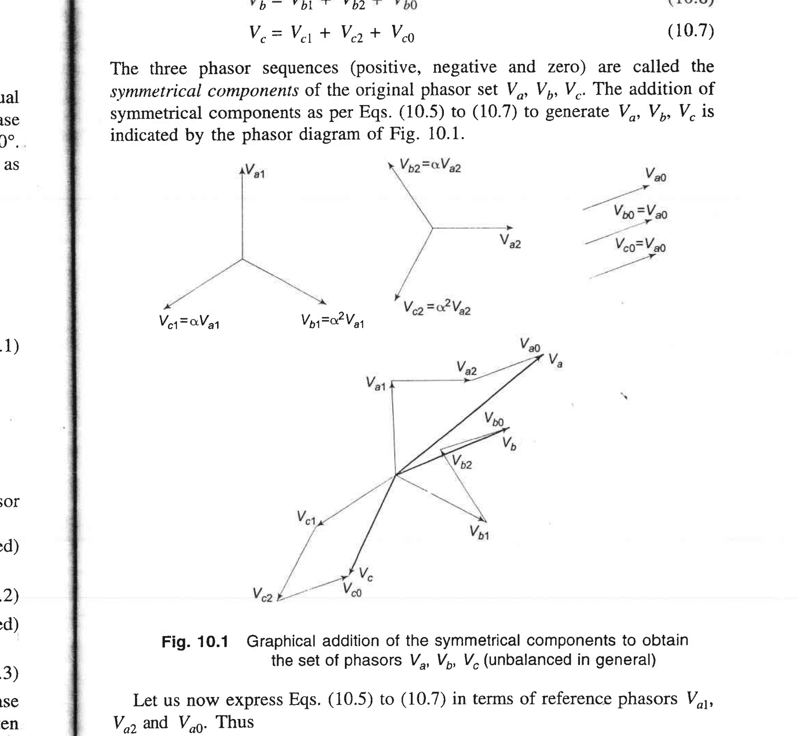
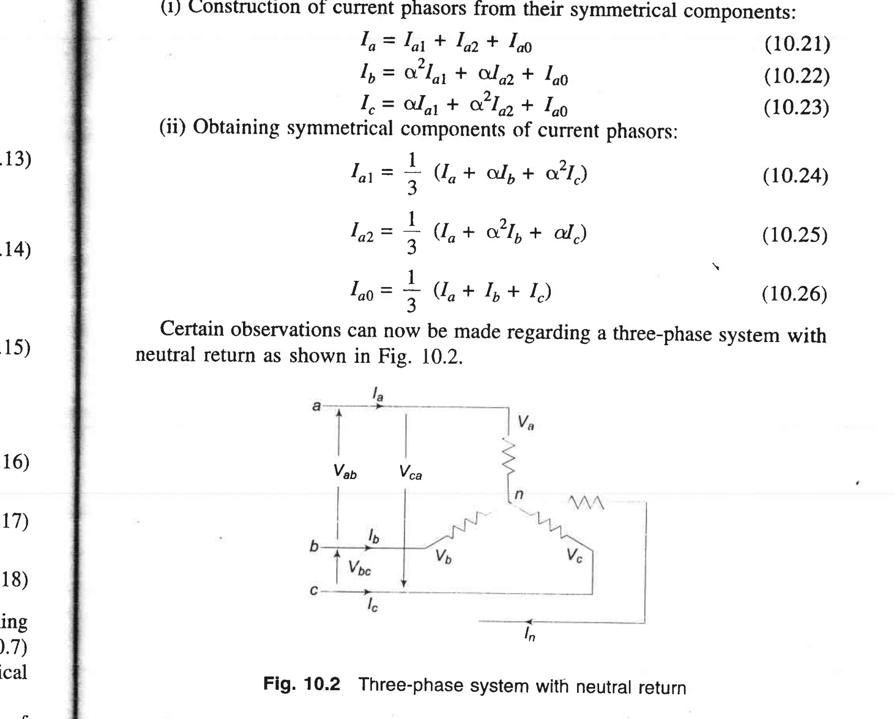
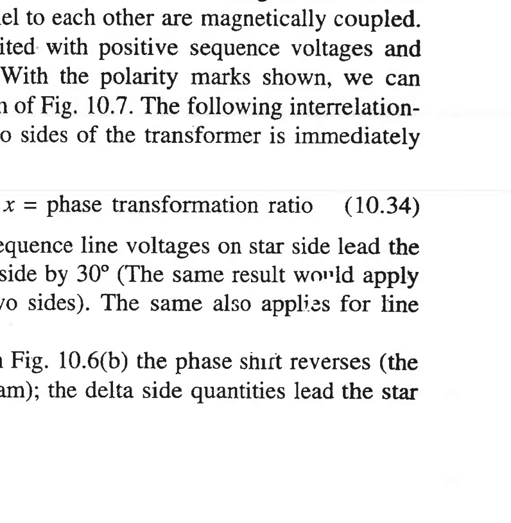
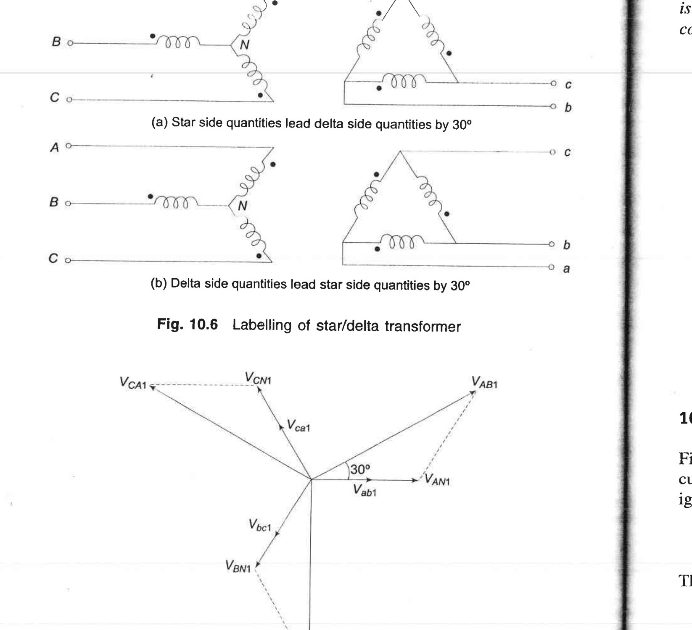
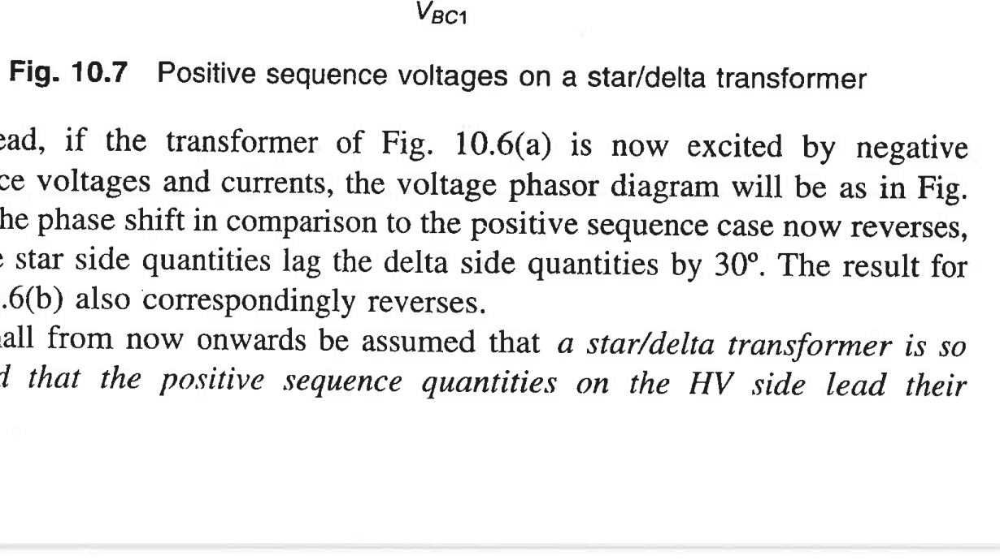
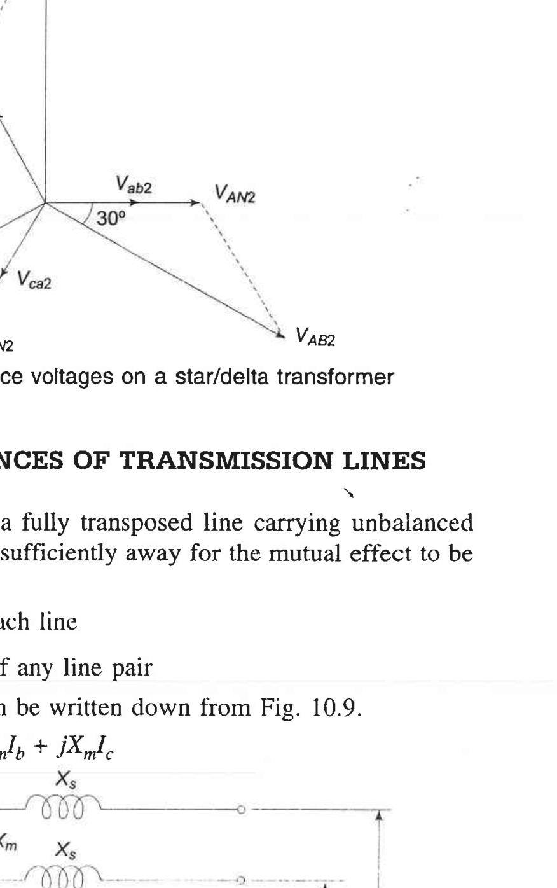
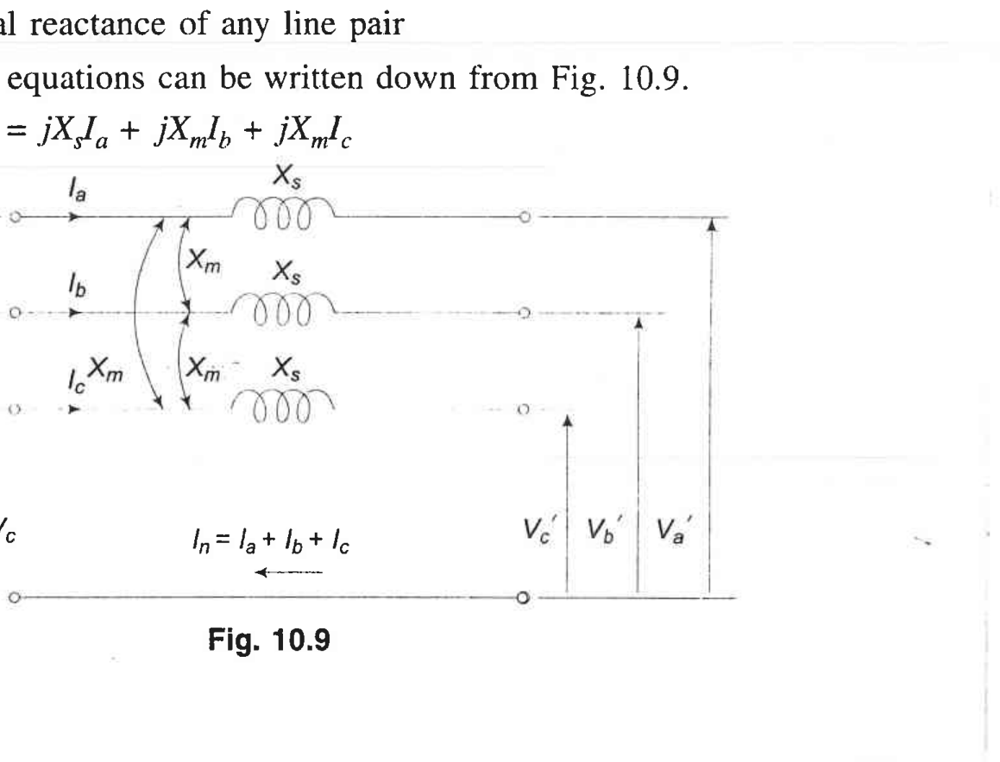
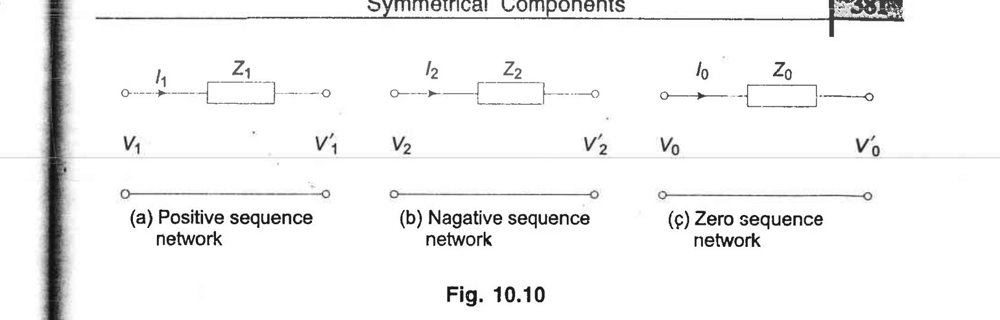
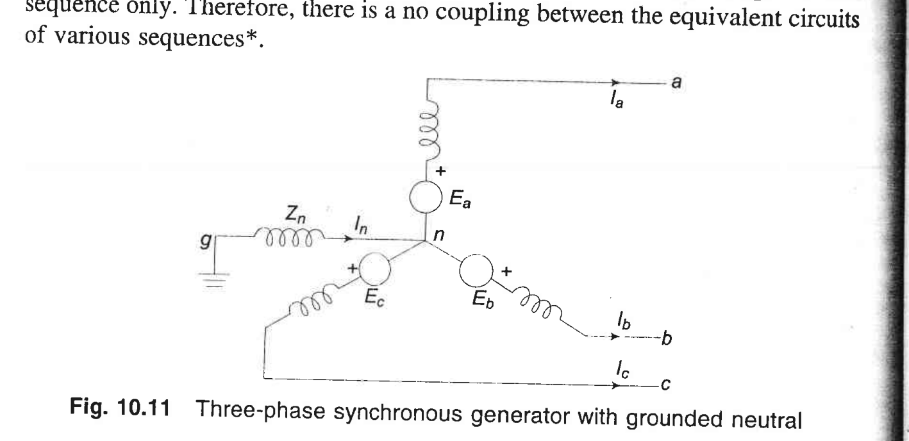
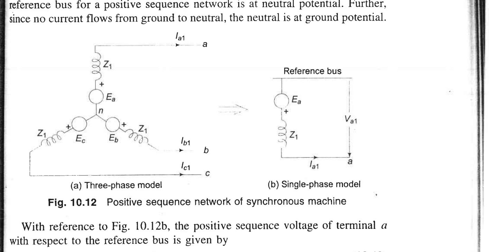

# Unit I — Symmetrical Component Transformation

> *Why this unit exists:* Almost every real-world fault on a power system (a tree falling on one line, lightning striking one phase, a broken conductor) unbalances the three phases. The comfortable world of per-phase analysis — where we analyze just phase a and multiply answers by √3 — instantly breaks. Fortescue's 1918 theorem of **symmetrical components** saves us: it lets us take any messy unbalanced set of three phasors and rewrite it as the sum of *three* perfectly balanced sets, each of which we can analyze with ordinary per-phase tools.
>
> Source: K&N Ch. 10, §10.1–10.9 (book pp. 369–393; PDF pp. 193–206).

---

## 1.1 What "balanced" vs "unbalanced" actually means 🟡

First, plain words about what is true in a balanced three-phase system, so you can see what we lose the moment a fault happens.

In a **balanced** system, the voltages (or currents) in the three phases a, b, c have:

1. **Equal magnitude** — |V<sub>a</sub>| = |V<sub>b</sub>| = |V<sub>c</sub>|.
2. **Equal 120° phase separation** — V<sub>b</sub> lags V<sub>a</sub> by 120°, V<sub>c</sub> lags V<sub>b</sub> by 120° (for positive sequence abc).
3. Because of 1 and 2, V<sub>a</sub> + V<sub>b</sub> + V<sub>c</sub> = 0. No current flows in the neutral; there is no voltage between neutral and ground.

Because phases b and c are just rotated copies of phase a, you can analyze one phase and be done — that is "per-phase analysis," which is why Power Systems-I was manageable.

In an **unbalanced** system, at least one of these fails: magnitudes differ, phase angles aren't exactly 120°, or both. For example, if phase a is shorted to ground, |V<sub>a</sub>| collapses near zero while |V<sub>b</sub>| and |V<sub>c</sub>| remain near normal. Then V<sub>a</sub> + V<sub>b</sub> + V<sub>c</sub> ≠ 0, neutral current flows, and per-phase analysis fails because the three phases are no longer copies of each other.

The naive response would be: "Fine, let's just analyze all three phases with KVL/KCL." That gives you a messy 3×3 coupled system of equations for every element — still doable by computer, but it completely destroys the *insight* that made balanced analysis easy. Symmetrical components is the clever alternative.

**❓ Understanding checkpoint:** In a balanced Y-connected load, what is V<sub>a</sub> + V<sub>b</sub> + V<sub>c</sub>? What happens to that sum if phase a becomes shorted to ground?
  - *Answer:* Zero in balanced operation (so I<sub>n</sub> = 0). After an LG fault, V<sub>a</sub> ≈ 0 but V<sub>b</sub>, V<sub>c</sub> ≈ V<sub>f</sub>, so the sum is ≈ V<sub>b</sub> + V<sub>c</sub> ≠ 0 and neutral current flows.

---

## 1.2 Fortescue's big idea — in words, in pictures, and in an equation 🟡

### In words
Any set of three unbalanced phasors (V<sub>a</sub>, V<sub>b</sub>, V<sub>c</sub>) can be written exactly as the **sum of three balanced sets**:

- A **positive-sequence** set (subscript 1): balanced, normal abc rotation, just like healthy operation.
- A **negative-sequence** set (subscript 2): balanced, but rotating backwards — acb order. You can think of this as the "wrong-direction" component produced by the unbalance.
- A **zero-sequence** set (subscript 0): three identical phasors (same magnitude, same angle) — no rotation at all. These are all in phase with each other.

### In pictures
Look at Fig. 10.1 from K&N. The top row shows the three constituent balanced sets by themselves; the big diagram at the bottom shows them added head-to-tail to produce the actual (unbalanced) V<sub>a</sub>, V<sub>b</sub>, V<sub>c</sub>.



**Figure 1.1** — Graphical addition of symmetrical components to obtain V<sub>a</sub>, V<sub>b</sub>, V<sub>c</sub>. *Source: K&N Fig. 10.1, book p. 371, PDF p. 194.*

Take a moment to read the diagram:
- Top-left: three arrows 120° apart (V<sub>a1</sub>, V<sub>b1</sub>, V<sub>c1</sub>) — positive sequence, balanced abc rotation.
- Top-middle: three arrows 120° apart but with b and c swapped (V<sub>a2</sub>, V<sub>b2</sub>, V<sub>c2</sub>) — negative sequence, acb rotation.
- Top-right: three parallel arrows all the same length and direction (V<sub>a0</sub>, V<sub>b0</sub>, V<sub>c0</sub>) — zero sequence, all in phase.
- Bottom: adding those nine arrows vectorially (V<sub>a</sub> = V<sub>a1</sub>+V<sub>a2</sub>+V<sub>a0</sub>, similarly for b and c) yields the unbalanced V<sub>a</sub>, V<sub>b</sub>, V<sub>c</sub> in heavy lines.

### In equation form
The synthesis ("going from components back to original phasors") is:
```
V_a = V_{a1} + V_{a2} + V_{a0}                                            (1.1)
V_b = V_{b1} + V_{b2} + V_{b0}                                            (1.2)
V_c = V_{c1} + V_{c2} + V_{c0}                                            (1.3)
```
(This is K&N Eqs. 10.5–10.7, book p. 371.)

**Why this is brilliant:** Each of the three sets (positive, negative, zero) is *internally balanced*, so for each set individually we can use ordinary per-phase analysis. Better still — and this is the key physical fact, not just math — every *passive symmetric* power-system element (transposed transmission line, symmetric generator, symmetric transformer) turns out to **decouple** the three sequences: a positive-sequence voltage drives only positive-sequence current, negative drives only negative, zero drives only zero. So instead of one messy 3-phase problem, we get **three separate one-phase problems** that we solve independently and then add up.

> ⚠️ **Common misconception:** Symmetrical components are not an approximation. They are an exact linear transformation of the phasors, like rotating a coordinate system. Nothing is lost, nothing is assumed other than linearity (which AC circuit theory already assumes).

**❓ Understanding checkpoint:** If a system is perfectly balanced (healthy operation), what are the values of V<sub>a2</sub> and V<sub>a0</sub>?
  - *Answer:* Both zero. In balanced operation, only positive sequence exists; that's why per-phase analysis worked in Power Systems-I — you were implicitly using only the positive-sequence network.

---

## 1.3 The `a` operator — the single most useful symbol in this unit 🔴 Slow down

### In words
To write the balanced-set relations compactly, we need a symbol that means "rotate this phasor by +120°" without changing its magnitude. That symbol is the complex number `a` (sometimes written `α` in K&N; K&N uses α, but I will use `a` in these notes because it's the more modern convention and avoids confusion with "α" as a generic constant).

### In pictures
Multiplying a complex number by `a` rotates it counterclockwise by 120°; multiplying by `a²` rotates by 240° (equivalently, clockwise by 120°).

(No diagram in K&N for this — it's just a unit circle. The reader can sketch a unit circle: `1` points right, `a` points up-left at 120°, `a²` points down-left at 240°.)

### In equations
Define
```
a = e^{j120°} = 1 ∠ 120° = -1/2 + j (√3/2)                (1.4)
```
Then, as consequences (K&N Eq. 10.1, book p. 370):
```
a² = e^{j240°} = -1/2 - j(√3/2)
a³ = e^{j360°} = 1                                        (1.5)
1 + a + a² = 0                                            (1.6)
a* = a²  (the complex conjugate of a is a²)               (1.7)
```
Equation (1.6) is what makes positive-sequence phasors sum to zero: 1 + a + a² = 0 ⇒ V<sub>a</sub> + a²V<sub>a</sub> + aV<sub>a</sub> = 0 for a balanced set. You should verify (1.6) by adding the real parts (-1/2 + -1/2 + 1 = 0) and imaginary parts (√3/2 + -√3/2 + 0 = 0).

### Why this operator, and not "just use trig"? 🟡
If we wrote everything out in sines and cosines, a balanced set would be described by three separate trig expressions related by phase shifts. The `a` operator lets us capture "this is phase b, which lags phase a by 120°" in *one symbol*. Without it, the matrix A in the next section would be full of cos and sin terms; with it, every entry is 1, a, or a². That is why this compact notation is universal.

**❓ Understanding checkpoint:** Without doing arithmetic, what is (a − 1)(a² + a + 1)?
  - *Answer:* Zero, because a² + a + 1 = 0. This kind of cancellation happens constantly in symmetrical-component algebra and is what keeps the matrices simple.

---

## 1.4 Describing each balanced set with one phasor 🟡

Because each sequence set is balanced, you only need to specify **one** phasor per set — the "reference" phasor, taken to be the a-phase phasor — and the other two follow by rotation.

**Positive sequence (suffix 1)** — normal abc order:
```
V_{a1} is the reference
V_{b1} = a² V_{a1}      (b lags a by 120°)
V_{c1} = a  V_{a1}      (c lags b by 120°, i.e. leads a by 120°)
```
K&N Eq. 10.2, book p. 370.

> 🟡 *Note on the sign:* V<sub>b1</sub> = a² V<sub>a1</sub> = V<sub>a1</sub> ∠−120° means "V<sub>b1</sub> lags V<sub>a1</sub> by 120°." In the standard abc rotation, going around the phasor counterclockwise (increasing angle) you hit a, then c, then b — wait, double check. Actually in abc phase sequence the order of *peaking* is a, b, c. V<sub>b</sub> = a² V<sub>a</sub> (angle −120°) means b lags a by 120° in time, as shown in Fig. 10.1 (V<sub>b1</sub> = α² V<sub>a1</sub> label).

**Negative sequence (suffix 2)** — reverse acb order:
```
V_{a2} is the reference
V_{b2} = a  V_{a2}      (b now leads a by 120° — reverse rotation)
V_{c2} = a² V_{a2}
```
K&N Eq. 10.3, book p. 370.

**Zero sequence (suffix 0)** — all three identical:
```
V_{a0} = V_{b0} = V_{c0}
```
K&N Eq. 10.4, book p. 370.

> ⚠️ **Common misconception:** "Negative sequence" does NOT mean negative frequency. It is still 50/60 Hz. It simply means the *phase order* is reversed: c peaks before b, which peaks before a. Physically, negative-sequence currents create a magnetic field in a rotating machine that spins *backwards* relative to the rotor — that is why negative-sequence currents cause extra rotor heating, but we'll get to that in §1.9.

---

## 1.5 The synthesis matrix A 🔵 Routine (but know what it does)

Now substitute the relations above back into equations (1.1)–(1.3). You get (K&N Eqs. 10.8–10.11, book pp. 371–372):

```
V_a = V_{a1} + V_{a2} + V_{a0}
V_b = a² V_{a1} + a V_{a2} + V_{a0}
V_c = a V_{a1} + a² V_{a2} + V_{a0}
```

In matrix form:
```
[ V_a ]   [ 1   1    1 ] [ V_{a1} ]
[ V_b ] = [ a²  a    1 ] [ V_{a2} ]                                   (1.8)
[ V_c ]   [ a   a²   1 ] [ V_{a0} ]
```
or, written compactly,
```
V_p = A V_s                                                             (1.9)
```
where **V<sub>p</sub>** = [V<sub>a</sub>, V<sub>b</sub>, V<sub>c</sub>]<sup>T</sup> is the "phase" (original) vector, **V<sub>s</sub>** = [V<sub>a1</sub>, V<sub>a2</sub>, V<sub>a0</sub>]<sup>T</sup> is the "sequence" (symmetrical-component) vector, and A is the 3×3 matrix above.

**Conceptually:** A takes the three single-phase "seed" phasors (one per sequence) and *builds* the three unbalanced phase voltages by rotating and adding.

---

## 1.6 The analysis matrix A⁻¹ 🔴 Slow down

Going forward we need to go the other way too: given the actual (unbalanced) phase voltages, extract their positive, negative, and zero sequence components. This is the inverse operation, V<sub>s</sub> = A⁻¹ V<sub>p</sub>.

Using the properties a³ = 1 and 1 + a + a² = 0, you can verify (or just accept) that:
```
         1  [ 1   a    a² ]
A⁻¹ =  ---  [ 1   a²   a  ]                                           (1.10)
         3  [ 1   1    1  ]
```
(K&N Eq. 10.15, book p. 372.) The factor of 1/3 is essential — it accounts for the fact that we added three copies of each component when synthesizing.

In expanded form (K&N Eqs. 10.16–10.18):
```
V_{a1} = (1/3)(V_a + a V_b + a² V_c)       ← positive-sequence extractor      (1.11)
V_{a2} = (1/3)(V_a + a² V_b + a V_c)       ← negative-sequence extractor      (1.12)
V_{a0} = (1/3)(V_a + V_b + V_c)            ← zero-sequence extractor          (1.13)
```

These three equations are the workhorses of fault analysis. **Memorize the shape, not the letters.** Notice:
- V<sub>a0</sub> is just the *average* of the three phase voltages. That makes sense: zero sequence is what all three have in common. If the three sum to zero (balanced case), V<sub>a0</sub> = 0.
- V<sub>a1</sub> is the average *with b and c rotated forward* by 120° and 240° respectively. Those rotations "un-do" the natural 120° lag of balanced b and c, so the three rotated phasors add in phase.
- V<sub>a2</sub> is the average *with the opposite rotation* — this cancels the positive sequence and leaves only the reverse-rotating component.

> 🟡 *Why 1/3 and not 1/√3 or something else?* Because when you add three balanced sets to recover V<sub>a</sub>, each phase's a-component gets contributions from all three seeds. The inverse must divide by the number of components being summed. This is exactly analogous to finding a Fourier coefficient by averaging over a period — the factor 1/3 is the length of the "period" (3 phases).

### Exactly the same transformation applies to currents
Because symmetrical components are a *linear* transformation on phasors, the identical A and A⁻¹ work for currents:
```
I_p = A I_s ,     I_s = A⁻¹ I_p                                         (1.14)
```
(K&N Eqs. 10.19–10.20, book p. 373.) Equations (1.11)–(1.13) hold with V replaced by I.

**❓ Understanding checkpoint:** For a balanced positive-sequence set (V<sub>b</sub> = a² V<sub>a</sub>, V<sub>c</sub> = a V<sub>a</sub>), what does formula (1.12) give for V<sub>a2</sub>?
  - *Answer:* V<sub>a2</sub> = (1/3)(V<sub>a</sub> + a²·a² V<sub>a</sub> + a·a V<sub>a</sub>) = (V<sub>a</sub>/3)(1 + a⁴ + a²) = (V<sub>a</sub>/3)(1 + a + a²) = 0. Good — balanced positive-sequence sets have zero negative-sequence content, exactly as we expect.

---

## 1.7 Three quick, important facts about zero sequence 🟡

These fall out of equation (1.13) and Kirchhoff's current law. They come up constantly in fault analysis, so memorize them.

Look at Fig. 10.2 from K&N — a Y-connected load with a neutral return wire carrying current I<sub>n</sub>.



**Figure 1.2** — Three-phase system with neutral return. *Source: K&N Fig. 10.2, book p. 373, PDF p. 195.*

**Fact 1 (neutral current):** KCL at the neutral gives I<sub>n</sub> = I<sub>a</sub> + I<sub>b</sub> + I<sub>c</sub>. From Eq. (1.13) for currents:
```
I_{a0} = (1/3)(I_a + I_b + I_c)
⇒ I_n = 3 I_{a0}                                                         (1.15)
```
(K&N text following Eq. 10.28, book p. 373.)
The neutral carries *three times* the zero-sequence current. This is a crucial fact for ground-relay settings: a relay in the neutral senses 3 I<sub>0</sub>.

**Fact 2 (no neutral ⇒ no zero-sequence current):** If there is no neutral wire (ungrounded Y, or an isolated neutral), then I<sub>n</sub> = 0 ⇒ I<sub>a0</sub> = 0. Zero-sequence current cannot flow.

**Fact 3 (line-line voltages have no zero sequence):** For the line voltages V<sub>ab</sub>, V<sub>bc</sub>, V<sub>ca</sub>, by KVL V<sub>ab</sub> + V<sub>bc</sub> + V<sub>ca</sub> = 0 (they form a closed triangle). Therefore their zero-sequence component is *always* zero, regardless of balance:
```
V_{ab,0} = (1/3)(V_{ab} + V_{bc} + V_{ca}) = 0                         (1.16)
```
(K&N Eq. 10.27, book p. 373.) Zero-sequence voltages appear only as line-to-neutral voltages, never as line-to-line.

**Fact 4 (delta connection traps zero-sequence):** In a Δ-connected load or transformer winding, zero-sequence currents can circulate inside the delta but cannot appear on the line terminals (since the line currents outside have no neutral return). This is why Y-Δ transformers are such common grounding transformers — they provide a zero-sequence path on the Y side and isolate it from the Δ side. (We will see this in §1.10.)

---

## 1.8 Power invariance — why there's a "3" 🔵

This is algebraic bookkeeping, but worth seeing once. The total three-phase complex power in the original (phase) variables is:
```
S_3φ = V_a I_a* + V_b I_b* + V_c I_c* = V_p^T I_p*                      (1.17)
```
Substituting V<sub>p</sub> = A V<sub>s</sub>, I<sub>p</sub> = A I<sub>s</sub>, and using the identity A<sup>T</sup> A* = 3 I (you can check this using the properties of `a`):
```
S_3φ = 3 (V_{a1} I_{a1}* + V_{a2} I_{a2}* + V_{a0} I_{a0}*)            (1.18)
```
(K&N Eq. 10.33, book p. 374.)

> 🟡 *Interpretation:* Power is conserved (as it must be — we just changed coordinates), and the factor "3" is the price of our particular normalization of A. Each sequence network carries its own power (V<sub>s,i</sub> I<sub>s,i</sub>*) and they add with weight 3. This means we can compute power in each sequence network separately and add — we never get cross-terms like V<sub>a1</sub> I<sub>a2</sub>*, which is another manifestation of sequence decoupling.

---

## 1.9 Phase shift in star-delta transformers 🔴 Slow down

### Why we care
Power systems are full of Y-Δ (wye-delta) transformers. When you work a fault problem that crosses one, the positive- and negative-sequence quantities **do not** just scale by the turns ratio — they also rotate by ±30°. If you forget this shift, your fault calculations will be wrong by a predictable factor, and more importantly the phase-sequence relays will be set incorrectly.

### The dot convention (one-pole refresher)
Fig. 10.5 from K&N shows a single-phase two-winding transformer with polarity marks (dots):



**Figure 1.3** — Polarity marking (dot convention) on a single-phase transformer. *Source: K&N Fig. 10.5, book p. 377, PDF p. 197.*

Currents entering both dotted terminals produce aiding flux. Therefore, the voltage V<sub>HH′</sub> across the primary (H to H′) is in phase with V<sub>LL′</sub> across the secondary when we measure both from non-dot to dot (or both dot to non-dot). If you reverse one winding, the voltage flips sign (180° shift).

### The standard Yd11 connection and its +30° shift
Now look at Fig. 10.6 (K&N) — a star-delta transformer with two possible labelings.



**Figure 1.4** — Labelling of star/delta transformer: (a) star-side quantities lead delta side by 30°, (b) delta-side quantities lead star side by 30°. *Source: K&N Fig. 10.6, book p. 378, PDF p. 198.*

When you connect three single-phase transformers in Y on the primary and Δ on the secondary (or vice versa), the line-to-line voltage on the Y side is the voltage *across one* winding scaled by √3, but the line-to-line voltage on the Δ side is the phasor *difference* of two adjacent windings. Working through the geometry (K&N does it graphically in Fig. 10.7), you find:



**Figure 1.5** — Positive-sequence voltages on a star/delta transformer (HV star side leads LV delta side by 30°). *Source: K&N Fig. 10.7, book p. 378, PDF p. 198.*

**The standard convention (ANSI/IEEE and also adopted by K&N from this point onward):** the positive-sequence quantities on the HV (high-voltage) side **lead** their corresponding LV (low-voltage) side quantities by **30°**. In phasor terms, with n the turns ratio:
```
V_{AN1} = n ∠30° · V_{an1}        (HV positive-seq leads LV by +30°)     (1.19)
```
(K&N Eq. 10.34, book p. 377.)

### Negative sequence shifts the other way



**Figure 1.6** — Negative-sequence voltages on a star/delta transformer (HV star side lags LV delta side by 30°). *Source: K&N Fig. 10.8, book p. 379, PDF p. 198.*

For negative sequence, the phase rotation is reversed, which flips the sign of the phase shift:
```
V_{AN2} = n ∠−30° · V_{an2}       (HV negative-seq lags LV by 30°)       (1.20)
```
(K&N text near Fig. 10.8.)

### Zero sequence — no shift, but possibly blocked
Zero-sequence currents are in phase in all three windings. Across a Y-Δ bank, zero-sequence current *can* circulate inside the delta but cannot flow in or out of the delta's line leads (there's no neutral on the delta side). So there is no phase-shift issue for zero sequence, but there is a **through/blocked** question that depends on connection type and neutral grounding — that's §1.11.

> ⚠️ **Common misconception:** "The transformer physically delays the wave by 30°." No. The 30° is not a time delay — it's a geometric consequence of how you connect the windings into three-phase sets. A Y-Y or Δ-Δ transformer has 0° phase shift; a Y-Δ has ±30°. The 50/60 Hz wave itself is not shifted in time; the *line-to-line* and *line-to-neutral* phasors simply refer to different combinations of winding voltages.

**❓ Understanding checkpoint:** If positive-sequence voltage on the LV delta side is 1∠0° pu and the transformer ratio is 1:1 (in per-unit), what is the HV star-side positive-sequence voltage under the K&N convention?
  - *Answer:* 1∠+30° pu. The HV side leads by 30°.

---

## 1.10 Sequence impedances of transmission lines 🟡

### The physical picture
A three-phase transmission line is just three long parallel conductors strung between towers. Each conductor has self-inductance (its own magnetic field), and there is mutual inductance between every pair (the magnetic field from one thread links the others). When the line is fully **transposed** (the phases are rotated so that each phase occupies each position for 1/3 of the line length, which nearly every HV line is), the self inductance is identical for all three phases and the mutual inductance between any pair is identical. That symmetry is what makes symmetrical components work for lines.

Look at Fig. 10.9 from K&N (which you already saw partially earlier). It shows three conductors with self reactance X<sub>s</sub> per phase and mutual reactance X<sub>m</sub> between every pair; the return path for the neutral current I<sub>n</sub> = I<sub>a</sub> + I<sub>b</sub> + I<sub>c</sub> is assumed remote enough to ignore for the voltage drop calculation.



**Figure 1.7** — Fully transposed three-phase line showing self (X<sub>s</sub>) and mutual (X<sub>m</sub>) reactances, with neutral return current I<sub>n</sub>. *Source: K&N Fig. 10.9, book p. 379, PDF p. 198.*

### The coupled voltage equations (🔵 Routine — skip the algebra on first read)
KVL gives:
```
V_a - V'_a = j X_s I_a + j X_m I_b + j X_m I_c
V_b - V'_b = j X_m I_a + j X_s I_b + j X_m I_c
V_c - V'_c = j X_m I_a + j X_m I_b + j X_s I_c
```
(K&N Eq. 10.35, book p. 380.) In matrix form, V<sub>p</sub> − V′<sub>p</sub> = Z<sub>p</sub> I<sub>p</sub>, where Z<sub>p</sub> is a 3×3 matrix with X<sub>s</sub> on the diagonal and X<sub>m</sub> off-diagonal.

### The magic: transforming to sequence coordinates
Replace V<sub>p</sub> = A V<sub>s</sub>, I<sub>p</sub> = A I<sub>s</sub>. Multiply both sides of Z<sub>p</sub> I<sub>p</sub> = V<sub>p</sub> − V′<sub>p</sub> by A⁻¹:
```
V_s - V'_s = (A⁻¹ Z_p A) I_s
```
Grinding out the product (K&N Eq. 10.40, book p. 380) gives a **diagonal** matrix — no off-diagonal terms:
```
[V1]   [Z1  0   0 ][I1]
[V2] = [0   Z2  0 ][I2]                                                       (1.21)
[V0]   [0   0   Z0][I0]
```
with
```
Z1 = j(X_s - X_m)   positive-sequence impedance                            (1.22)
Z2 = j(X_s - X_m)   negative-sequence impedance                            (1.23)
Z0 = j(X_s + 2X_m)  zero-sequence impedance                                (1.24)
```
(K&N Eqs. 10.43–10.45, book p. 381.)

### The physical conclusions 🟡 (this is the part that matters)
1. **For a fully transposed line, Z<sub>1</sub> = Z<sub>2</sub>.** A passive static element like a wire doesn't care which direction the phases rotate — its impedance is the same for positive and negative sequence. This is true of all passive symmetric elements (lines, cables, transformers, static loads). It is *not* true of rotating machines, as we are about to see.
2. **Z<sub>0</sub> is much larger than Z<sub>1</sub>** — typically about 2 to 3.5 times larger for overhead lines. Why? In zero-sequence flow, all three phase currents are in phase and return through the ground (and overhead ground wires). The magnetic field from those three in-phase currents reinforces rather than cancels, adding 2X<sub>m</sub> instead of subtracting it. Zero-sequence impedance is therefore higher and depends strongly on ground resistivity and ground wires.
3. **The three sequence networks are decoupled** (Fig. 10.10):



**Figure 1.8** — Sequence networks of a fully transposed transmission line: three independent single-phase circuits. *Source: K&N Fig. 10.10, book p. 381, PDF p. 199.*

Each is just a plain series impedance. You analyze each separately. That's the payoff.

> ⚠️ **Common misconception:** "Z<sub>0</sub> includes the ground resistance so it's larger because ground is resistive." Partly true, but even in a purely reactive world (perfect conductors), Z<sub>0</sub> > Z<sub>1</sub> because of the mutual-reinforcement factor 2X<sub>m</sub>. In fact for overhead lines Z<sub>0</sub> has a substantial resistive component too, because returning through real earth incurs real I²R loss.

---

## 1.11 Sequence impedances of synchronous machines 🔴 Slow down

This is where sequences start behaving differently from each other — because a generator has rotating parts and an internal EMF.

Fig. 10.11 shows the physical starting point: a three-phase synchronous generator whose neutral is grounded through an impedance Z<sub>n</sub>. The internal EMFs E<sub>a</sub>, E<sub>b</sub>, E<sub>c</sub> are produced by the rotating DC field.



**Figure 1.9** — Three-phase synchronous generator with grounded neutral (grounding impedance Z<sub>n</sub>). *Source: K&N Fig. 10.11, book p. 382, PDF p. 200.*

Now examine each sequence separately.

### Positive sequence (Fig. 10.12)
When balanced positive-sequence currents flow in the stator, they create a magnetic field that rotates in the **same direction and at the same speed** as the rotor. Relative to the rotor, this field is stationary — it "sees" the machine along the direct axis. The impedance seen is the familiar machine reactance, which varies with time because of damper windings and field-winding transients:



**Figure 1.10** — Positive-sequence network of a synchronous machine: (a) three-phase, (b) single-phase model. *Source: K&N Fig. 10.12, book p. 383, PDF p. 200.*

```
Z1 = j X''_d   subtransient (first 1–2 cycles after a fault)
   = j X'_d    transient (next few cycles)
   = j X_d     steady-state (synchronous)
```
(K&N Eqs. 10.46–10.48, book p. 383.) The positive-sequence network **contains the internal EMF E<sub>a</sub>**, because that is the sequence the rotor is designed to produce. The voltage equation (per phase) is:
```
V_{a1} = E_a - Z_1 I_{a1}                                                   (1.25)
```
(K&N Eq. 10.49.) Notice Z<sub>n</sub> does **not** appear — positive-sequence currents sum to zero at the neutral, so no current flows through Z<sub>n</sub>.

### Negative sequence (Fig. 10.13)
Negative-sequence currents create a stator field that rotates **opposite** to the rotor. From the rotor's point of view, this field sweeps past at *twice* synchronous speed, inducing double-frequency currents in the rotor iron and damper windings. The machine looks like a nearly short-circuited damper winding to this reverse field.
- There is **no internal EMF** for negative sequence — the rotor's DC field spins the other way.
- Z<sub>2</sub> is roughly the average of d- and q-axis subtransient reactances: Z<sub>2</sub> ≈ j(X″<sub>d</sub> + X″<sub>q</sub>)/2, with |Z<sub>2</sub>| < |Z<sub>1</sub>| (K&N Eq. 10.50, book p. 384).
- Again no Z<sub>n</sub>: negative-sequence currents also sum to zero.

The voltage equation is simply
```
V_{a2} = 0 - Z_2 I_{a2} = -Z_2 I_{a2}                                      (1.26)
```
(K&N Eq. 10.51.)

### Zero sequence (Fig. 10.14)
Zero-sequence currents are all in phase and equal. The mmfs they produce are 120° apart in space but in phase in time, so their net air-gap field is **zero**. The machine therefore presents only the stator leakage reactance Z<sub>0g</sub> to zero-sequence currents. Critically, zero-sequence current does flow through the neutral grounding impedance Z<sub>n</sub> — the neutral current is I<sub>n</sub> = 3 I<sub>a0</sub>, creating a voltage drop of 3 Z<sub>n</sub> I<sub>a0</sub> from neutral to ground. The per-phase zero-sequence network therefore contains Z<sub>0g</sub> in series with **3 Z<sub>n</sub>** (the factor 3 comes from reflecting the 3I<sub>a0</sub> drop into per-phase terms).

There is no internal EMF for zero sequence either:
```
V_{a0} = - (Z_{0g} + 3 Z_n) I_{a0} = - Z_0 I_{a0}                         (1.27)
```
(K&N Eqs. 10.52–10.54.)

### Typical values (🔵 Routine reference)
K&N give these for a 5 MVA, 6.6 kV, 3000 rpm turbo-generator (book p. 385):
- Z<sub>1</sub> = 12% (subtransient), 20% (transient), 110% (synchronous)
- Z<sub>2</sub> = 12%
- Z<sub>0</sub> = 5%

Note: Z<sub>0</sub> < Z<sub>2</sub> ≈ Z″<sub>d</sub> for this machine, and Z<sub>1</sub>(synchronous) is much larger than the others. Which value of Z<sub>1</sub> to use depends on *when* after a fault you are computing currents — we will be explicit about this in Unit II.

> ⚠️ **Common misconception:** "Z<sub>0</sub> is always bigger than Z<sub>1</sub> like it is for lines." *For generators*, Z<sub>0</sub> is typically *smaller* than Z<sub>1</sub> (in subtransient terms Z<sub>0</sub> ≈ 0.5 Z<sub>1</sub>; in synchronous terms Z<sub>0</sub> is vastly smaller). Lines and machines have opposite ordering; don't generalize from one to the other.


---

## 1.12 Sequence impedances of transformers 🔵 (conceptually lighter)

### The key facts
A transformer is a **static** symmetric element, so Z<sub>1</sub> = Z<sub>2</sub> = Z<sub>leakage</sub>, the ordinary leakage impedance you met in Power Systems-I. There is no internal EMF in a transformer model (it's just an impedance between two buses).

Zero sequence is where transformers get interesting: **whether zero-sequence current can flow through a transformer at all depends on winding connections and neutral grounding.** This determines what the zero-sequence network looks like.

The rules (K&N §10.8, book pp. 386–388):
1. A **Y (ungrounded)** side blocks zero-sequence current — there's no path to neutral, so I<sub>0</sub> = 0. The zero-sequence network has an open circuit on that side.
2. A **Y grounded (solidly or through impedance Z<sub>n</sub>)** side lets zero-sequence flow; a neutral impedance Z<sub>n</sub> appears as 3Z<sub>n</sub> in the zero-sequence network (same factor of 3 as for generator neutrals).
3. A **Δ** side provides a closed path for zero-sequence current to circulate inside the delta, but zero-sequence cannot enter or leave the delta's line terminals. Therefore, from the line side of a Δ, the zero-sequence network sees an **open circuit**, but the delta side itself is effectively shorted to the zero-sequence reference bus through the leakage impedance (it acts as a "ground" in the zero-sequence equivalent).

The standard cases K&N describes:
- **Y<sub>g</sub>–Y<sub>g</sub> (both grounded):** Z<sub>0</sub> = Z<sub>leakage</sub>, zero-sequence flows through.
- **Y<sub>g</sub>–Y (one ungrounded):** zero-sequence blocked on the ungrounded side — the zero-sequence network has an open there.
- **Y<sub>g</sub>–Δ:** zero-sequence flows on the Y<sub>g</sub> side and circulates in the delta; from the Δ lines, zero-sequence is open. A Y<sub>g</sub>–Δ transformer is therefore a **zero-sequence ground source** on the Y side — this is why Y<sub>g</sub>-Δ transformers are ubiquitous as generator step-ups.
- **Δ–Δ:** zero-sequence circulates inside both deltas but appears as open on both line sides.

### Phase shift reminder
As covered in §1.9, Y-Δ and Δ-Y banks introduce a ±30° phase shift for positive and negative sequence, in opposite directions. Zero-sequence quantities experience no phase shift (all three are in phase, rotation direction is meaningless), but they may be blocked/short-circuited per the table above.

> 🟡 *Convention note (K&N):* From here on, K&N assumes star-delta transformers are labelled so that positive-sequence quantities on the HV side **lead** the LV side by 30° (negative-sequence lags by 30°). In per-unit on appropriate bases, this rotation is the only effect — magnitudes are unchanged.

---

## 1.13 Putting the three sequence networks together 🟡

### The big picture (K&N §10.9, book pp. 389–392)
For any complete power system:
- **The positive-sequence network** is exactly the one-line (per-phase) model you built in Power Systems-I. It contains:
  - Each generator modeled as E<sub>a</sub> in series with Z<sub>1</sub> (use X″<sub>d</sub>, X′<sub>d</sub>, or X<sub>d</sub> depending on timeframe).
  - Each transformer as its leakage impedance (plus the ±30° phase shift for Y-Δ banks, if needed).
  - Each transmission line as Z<sub>1</sub> = Z<sub>line</sub>.
  - Each load, typically as a shunt impedance to reference bus.
  - The reference (slack) bus is at neutral/ground potential.
- **The negative-sequence network** has the *same topology* (same connections between buses) but:
  - All internal EMFs are zero (generators become just Z<sub>2</sub> from terminal to reference).
  - Generator impedance is Z<sub>2</sub> (not Z<sub>1</sub>).
  - Line Z<sub>2</sub> = Z<sub>1</sub>; transformer Z<sub>2</sub> = Z<sub>1</sub>.
  - The ±30° phase shifts across Y-Δ transformers have reversed sign.
- **The zero-sequence network** has a topology that may differ from the positive-sequence network because:
  - Δ windings block zero-sequence through paths.
  - Ungrounded Y neutrals block zero-sequence.
  - Neutral impedances appear as 3Z<sub>n</sub> in series.
  - Generators are just Z<sub>0g</sub> + 3Z<sub>n</sub> to reference (no EMF).
  - Lines have Z<sub>0</sub> (typically 2–3.5 Z<sub>1</sub>).

The **reference bus** (neutral/ground) is the same for all three networks, but the networks are separate — they connect to each other *only* at the fault point. How they connect depends on the type of fault, which is the subject of Unit II.

### Why this is enough
Every symmetric power-system element (generators, lines, transformers, static loads) has the decoupling property: currents of one sequence produce voltage drops of that same sequence only. That decoupling — the entire point of this unit — is what reduces an unbalanced fault problem from "one horrible 3N×3N coupled system" to "three separate N-bus single-phase problems, coupled only by the fault boundary conditions."

---

## 1.14 Unit I self-check and summary 🟢

### Key takeaways
1. Symmetrical components decompose any 3 unbalanced phasors into 3 balanced sets: positive (abc), negative (acb), zero (all in phase).
2. The "a" operator = e^{j120°} rotates a phasor by +120°. Properties: a³ = 1 and 1 + a + a² = 0.
3. Synthesis (components → phase): V<sub>p</sub> = A V<sub>s</sub>. Analysis (phase → components): V<sub>s</sub> = A⁻¹ V<sub>p</sub>, with the 1/3 factor.
4. Neutral current I<sub>n</sub> = 3 I<sub>a0</sub>. Line-line voltages have zero V<sub>0</sub>.
5. Across a standard Y-Δ transformer: positive sequence shifts +30° (HV leads LV), negative shifts −30°, zero is blocked/short-circuited per winding configuration.
6. For passive symmetric elements (lines, transformers): Z<sub>1</sub> = Z<sub>2</sub>. For lines Z<sub>0</sub> ≈ (2–3.5) Z<sub>1</sub>; for generators Z<sub>2</sub> ≈ (X″<sub>d</sub> + X″<sub>q</sub>)/2, Z<sub>0g</sub> is small (leakage only), and only the positive-sequence network has internal EMFs.
7. The three sequence networks are *separate*. They connect only at the fault point — that connection is the subject of Unit II.

### Final understanding checkpoint (don't skip)
❓ In a system with one generator Y-grounded through a reactor, connected via a Y<sub>g</sub>-Δ step-up transformer to a transmission line, connected via a Δ-Y<sub>g</sub> step-down to an ungrounded Y load: which of the three sequence networks "see" the load, which "see" the generator neutral reactor, and which have EMFs?
  - *Answer:* Positive and negative networks reach all the way to the load (with a +30° then −30° phase shift that cancels), but only the positive network has EMFs (in the generator). The zero-sequence network is blocked at the ungrounded Y load (open) and at the Δ windings of the step-up transformer from the line side; on the generator side, zero-sequence sees 3Z<sub>n</sub> + Z<sub>0g</sub> in series to reference, with the Δ side appearing as a short through leakage impedance. Zero-sequence current can flow from the generator neutral but cannot reach the load or the high-voltage line.

> 🔵 **Pacing note:** If you've followed up to here, you have all the tools needed for Unit II. If anything in §1.10–1.13 felt murky, it's usually a sign to re-read §1.2 and §1.6 — those contain the actual idea; the rest is applying the idea to each physical element.
