# Unit II — Symmetrical and Unsymmetrical Fault Analysis

> *Why this unit exists:* A fault — usually an accidental short circuit (line-to-ground, line-to-line, etc.) or open conductor — is the most common "abnormal" event on a power system. Fault currents can be tens of times larger than normal load currents and will destroy equipment in milliseconds if uninterrupted. We must calculate these currents to size circuit breakers, set relays, and choose current-limiting reactors. Symmetrical components (Unit I) turn each fault type into a simple rule for connecting the three sequence networks together at the fault point.
>
> Source: K&N Ch. 9 (symmetrical faults, book pp. 327–368; PDF pp. 172–193) and Ch. 11 (unsymmetrical faults, book pp. 397–432; PDF pp. 207–226).

---

## 2.1 What a fault is, physically 🟡

A **fault** is any abnormal connection that interferes with normal current flow:
- **Shunt faults** (accidental shorts between phases or phase-to-ground):
  - 3-phase fault (symmetrical, L-L-L or L-L-L-G)
  - Single line-to-ground (LG)
  - Line-to-line (LL)
  - Double line-to-ground (LLG)
- **Series faults** (one or two phases open):
  - One open conductor
  - Two open conductors

The vast majority of faults on overhead lines are single line-to-ground (~70–80%), followed by LLG and LL; three-phase faults are rare (~5%) but usually produce the *largest* fault current and are therefore the benchmark for breaker sizing.

🟡 *Why do faults produce such big currents?* A fault is a near-short-circuit across the system. The voltage at the fault point collapses nearly to zero, and the only thing limiting current is the series impedance between the generators and the fault — transformers, lines, and the generators' own internal reactance. Because those impedances are small (a few percent to a few tens of percent on the system base), fault currents can be 5 to 20 times rated current.

---

## 2.2 Short circuit transients on a simple R-L line — the DC offset 🟡

Before we look at synchronous-machine short circuits, look at the simpler case of a passive transmission line suddenly shorted through a source (K&N Fig. 9.1 and 9.2).

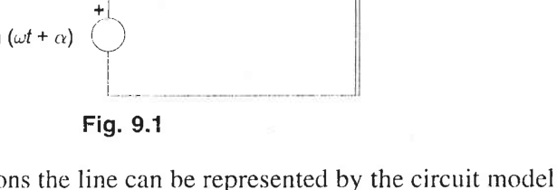

**Figure 2.1** — A short-circuited transmission line modelled as an R-L circuit switched onto an AC source. *Source: K&N Fig. 9.1, book p. 329, PDF p. 172.*

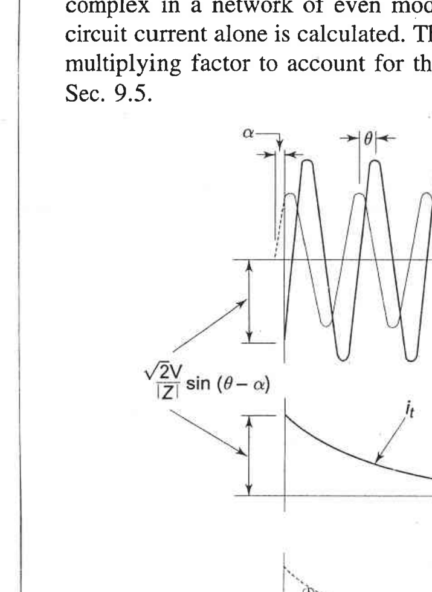

**Figure 2.2** — Short-circuit current on a transmission line (R-L circuit): steady-state AC component `i_s`, decaying DC transient `i_t`, and total current `i = i_s + i_t` showing asymmetric peak `i_mm`. *Source: K&N Fig. 9.2, book p. 330, PDF p. 173.*

The AC source `v = √2 V sin(ωt + α)` is switched onto an R-L circuit at `t = 0`. The solution has two parts: a steady-state symmetrical (sinusoidal) component `i_s` whose amplitude is fixed at `√2 V / |Z|`, and a **decaying DC offset** `i_t` whose initial magnitude is set by the point-on-wave where the fault occurs — it is whatever value is needed to satisfy the inductor law `i(0⁺) = i(0⁻) = 0`. The DC offset decays as `exp(−tR/L)` with the armature (line) time constant.

> 🟡 *Physical picture:* An inductor cannot change its current instantaneously. If the fault strikes at a voltage zero-crossing (the worst case, α = 0), the AC current wants to go to its peak immediately but the inductor says "current must start at zero", so a DC bias appears that holds the first half-cycle fully on one side — doubling the first peak. If the fault strikes at a voltage peak, the DC offset is zero and the waveform is symmetrical from the start.

This DC offset is universal to any inductive circuit switched onto AC and is the reason the very first peak of fault current can be almost **twice** the steady-state AC fault current. That first peak is what circuit breakers must survive closing into (the "momentary" duty).

---

## 2.3 Short circuit of a synchronous machine 🟡 (physical picture before formulas)

### The sequence of events after a 3-phase short at a generator's terminals
Imagine an unloaded synchronous generator running at synchronous speed with its field energized, producing rated terminal voltage V = E behind X<sub>d</sub>. Now bolt all three terminals together (solid three-phase short).

**Instant of the fault:** The stator currents try to jump to satisfy V = 0, but the flux linkages in the rotor field winding and damper windings *cannot change instantaneously* (inductors oppose sudden current change). Those windings act like the shorted secondary of a transformer, carrying large induced currents whose mmf cancels the armature-reaction flux. The generator therefore appears to have a very small internal reactance — this is **subtransient reactance X″<sub>d</sub>** — and the AC component of current is large: I″ = E/X″<sub>d</sub>.

**A few cycles later:** The damper-winding currents die out (resistive decay), but the field winding still constrains its flux linkage. Now the machine looks like it has **transient reactance X′<sub>d</sub>** (somewhat larger than X″<sub>d</sub>, smaller than X<sub>d</sub>), and current decays to I′ = E/X′<sub>d</sub>.

**After several seconds:** Field transients have decayed. The machine is in steady-state short circuit, limited only by **synchronous reactance X<sub>d</sub>**, giving I = E/X<sub>d</sub>.

In addition to the decaying AC component there is a **DC offset** in each phase — a DC transient that biases the AC wave up or down, depending on the voltage phase angle at the instant of the fault (just as in a simple R-L circuit switched at a non-zero voltage, see §2.2). The DC offset decays with the armature time constant and is what makes the first few peaks of fault current *especially* asymmetric and large.

### The circuit model at each stage (Fig. 9.3)

K&N model this behaviour as a voltage source E<sub>g</sub> behind a series reactance whose value changes as the damper and field-winding currents decay:

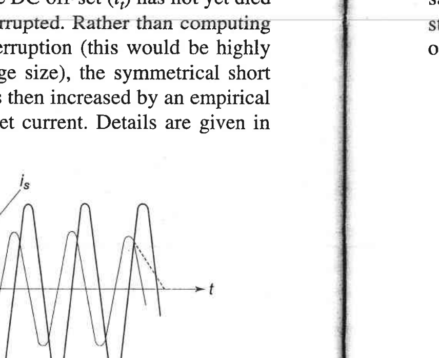

**Figure 2.3** — Approximate circuit models of a synchronous machine under short circuit: (a) steady-state model — voltage behind synchronous reactance X<sub>d</sub>; (b) subtransient period — damper-winding reactance X<sub>dw</sub> in parallel with field reactance X<sub>f</sub> and armature reactance X<sub>a</sub>, giving X″<sub>d</sub>; (c) transient period — damper currents have decayed (X<sub>dw</sub> open), leaving X<sub>f</sub> in parallel with X<sub>a</sub>, giving X′<sub>d</sub>. *Source: K&N Fig. 9.3, book p. 331, PDF p. 173.*

In algebraic terms (K&N Eqs. 9.5–9.6, book p. 332):
```
X''_d = X_l + 1/(1/X_a + 1/X_f + 1/X_dw)     subtransient
X'_d  = X_l + 1/(1/X_a + 1/X_f)              transient
X_d   = X_l + X_a                             synchronous (steady state)
```
with X<sub>l</sub> the armature leakage reactance, X<sub>a</sub> the armature-reaction reactance, X<sub>f</sub> the field-winding leakage referred to the stator, and X<sub>dw</sub> the damper-winding leakage.

### Current envelope (Fig. 9.4)

The symmetrical (DC-offset removed) armature current decays through three stages, as shown in K&N Fig. 9.4:

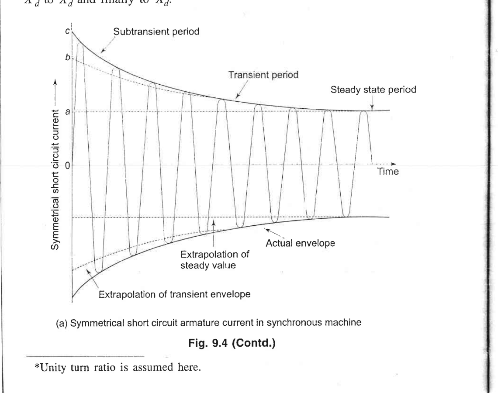

**Figure 2.4(a)** — Symmetrical short-circuit armature current of a synchronous machine, showing the subtransient, transient, and steady-state periods, with envelope extrapolations. *Source: K&N Fig. 9.4(a), book p. 332, PDF p. 174.*

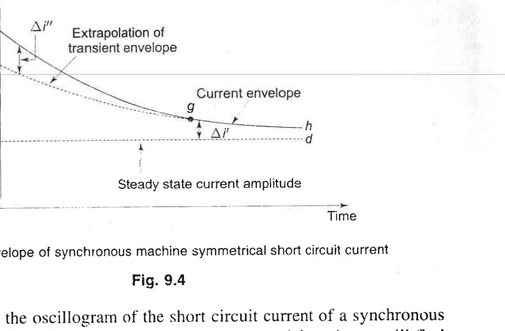

**Figure 2.4(b)** — Envelope of the symmetrical short-circuit current, showing how the subtransient Δi″ and transient Δi′ components decay exponentially on top of the steady-state amplitude. *Source: K&N Fig. 9.4(b), book p. 333, PDF p. 174.*

In equations (K&N Eqs. 9.7a–c, book p. 333):
```
|I|   = |E_g| / (√2 X_d)     steady-state rms current
|I'|  = |E_g| / (√2 X'_d)    transient rms current (excluding DC)
|I''| = |E_g| / (√2 X''_d)   subtransient rms current (excluding DC)
```

> 🟡 *Why this matters for circuit breakers:* The breaker must interrupt the current within a few cycles. It must be rated for the very largest current it will ever see — which is the first-cycle peak including DC offset (the "momentary" duty), and also the current it must actually interrupt a few cycles later (the "interrupting" duty, at the X′ level).

### Numerical feel 🔵 (round numbers)
If X″<sub>d</sub> = 0.12 pu, X′<sub>d</sub> = 0.20 pu, X<sub>d</sub> = 1.1 pu, and E = 1 pu (rated voltage):
- Subtransient current I″ = 1/0.12 ≈ 8.3 pu — about 8× rated.
- Transient current I′ = 1/0.20 = 5 pu.
- Steady-state I = 1/1.1 ≈ 0.9 pu — back to roughly rated.

That is why breakers must be rated for many times rated current.

---

## 2.4 Symmetrical (3-phase) fault calculation with prefault load 🔵

When a three-phase fault occurs at bus *F* in a loaded system:
1. The fault is balanced, so only the **positive-sequence** network is involved (I<sub>a2</sub> = I<sub>a0</sub> = 0).
2. Standard procedure (K&N §9.4–§9.6):
   - Obtain the prefault voltage V<sub>f</sub> at the fault bus (from a load flow; if unknown, assume 1∠0° pu for a conservative estimate).
   - Model each generator by its voltage behind the appropriate reactance (subtransient E″ behind X″<sub>d</sub> for momentary duty; transient E′ behind X′<sub>d</sub> for interrupting duty; for the simplest textbook "classical" approximation use E = 1 pu behind X″ for all generators with prefault load currents ignored).
   - Short all voltage sources (set EMFs to zero) to build the Thevenin impedance Z<sub>th,1</sub> looking back from the fault bus.
   - The fault current is:
     ```
     I_f = V_f / Z_{th,1}
     ```
     (with Z<sub>th,1</sub> = jX<sub>th</sub> usually, since resistances are small compared to reactances in HV systems).
3. Bus voltages and line currents throughout the system during the fault are then found by superposition: inject −V<sub>f</sub>/Z<sub>th,1</sub> at the fault bus with all other EMFs zeroed, and add to the prefault state.

A standard worked example from K&N is the radial system of Fig. 9.6 (book p. 335, PDF p. 175):

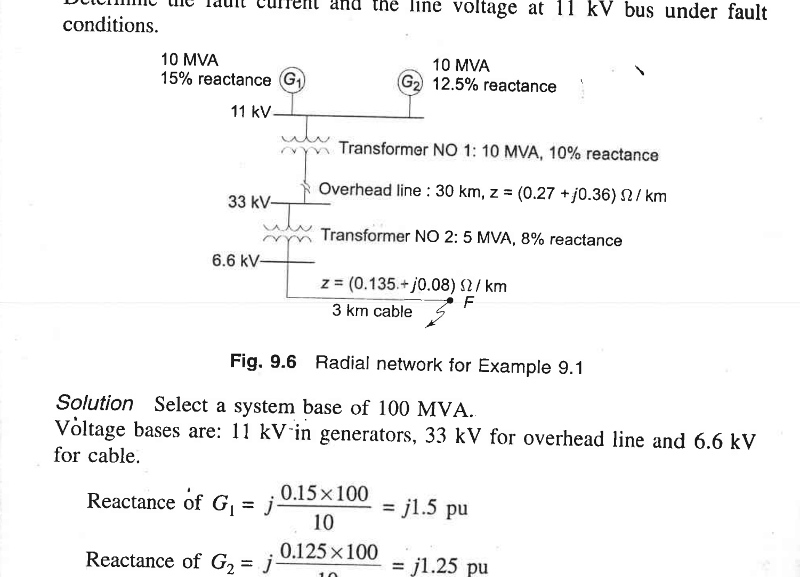

**Figure 2.5** — A radial system with two generators on a common HV bus, a step-down transformer, an overhead line, a cable, and a fault at F on the LV cable. (K&N Example 9.1.) *Source: K&N Fig. 9.6, book p. 335, PDF p. 175.*

The procedure is to convert every element to per-unit on a common base, sum the series impedances from the generators to the fault, and apply I<sub>f</sub> = V<sub>f</sub>/Z<sub>th,1</sub>.

> ⚠️ **Common misconception:** "Prefault load currents are zero so we can ignore them." For fault *magnitude*, ignoring load (setting prefault currents to zero and V<sub>f</sub> = 1 pu) is an approximation that slightly underestimates or overestimates depending on load, but is within ~10% and is standard for breaker-sizing studies. For relay settings and stability studies, the prefault state matters more.

### Worked example (small numbers, 3-phase fault) 🟡

**Problem.** Two identical generators share a common bus: each G1, G2 is 100 MVA, 11 kV, X″<sub>d</sub> = j0.2 pu on its own base. They feed a step-up transformer T (200 MVA, 11/132 kV, X = j0.1 pu on 200 MVA base) and a 132 kV transmission line (X = j50 Ω) to a remote bus where a solid 3-phase fault occurs. Use 100 MVA base.

**Step-by-step reasoning:**

1. **Convert everything to 100 MVA base.**
   - G1, G2: already on 100 MVA base, X″<sub>d</sub> = j0.2 pu each.
   - T: X = 0.1 × (100/200) = j0.05 pu.
   - Line: Z<sub>base</sub> at 132 kV, 100 MVA = (132)²/100 = 174.24 Ω, so X<sub>line</sub> = j50/174.24 = j0.287 pu.
2. **Draw the positive-sequence Thevenin from the fault.** Two generators in parallel (j0.2 || j0.2 = j0.1) in series with transformer (j0.05) and line (j0.287): Z<sub>th,1</sub> = j0.1 + j0.05 + j0.287 = j0.437 pu.
3. **Fault current in pu:** I<sub>f</sub> = V<sub>f</sub>/Z<sub>th,1</sub> = 1/j0.437 = −j2.29 pu (on 100 MVA, 132 kV).
4. **Convert to amperes:** I<sub>base</sub> at 132 kV = 100×10⁶/(√3 × 132×10³) = 437 A. So I<sub>f</sub> = 2.29 × 437 ≈ 1000 A.
5. **Fault MVA:** √3 × 132 kV × 1000 A ≈ 229 MVA (or directly, S<sub>f</sub> = S<sub>base</sub>/|Z<sub>th</sub>| = 100/0.437 ≈ 229 MVA).

**🟡 Does this make sense?** The parallel generators look like a single j0.1 pu source behind them (half of one unit's reactance), then transformer + line add ~j0.34 pu. The fault is on the remote end of a long line, so the current is moderate (~2.3 pu on 100 MVA base, i.e. about 2× the combined rated current of both generators). If the fault were on the HV bus of the transformer instead, Z<sub>th</sub> would be just j0.1 + j0.05 = j0.15 pu, I<sub>f</sub> = 6.67 pu ≈ 2900 A — a much bigger number, which is why breakers on station buses must be rated higher than breakers on remote line ends.

---

## 2.5 The connection rules for unsymmetrical shunt faults 🔴 Slow down

This is the central result of Unit II. For every fault type, the three sequence networks (positive, negative, zero) are connected together at the fault point **in a particular series/parallel configuration** determined by the fault boundary conditions.

K&N set this up by first drawing the three sequence networks each with a fault terminal F (Fig. 11.2 / 11.3):

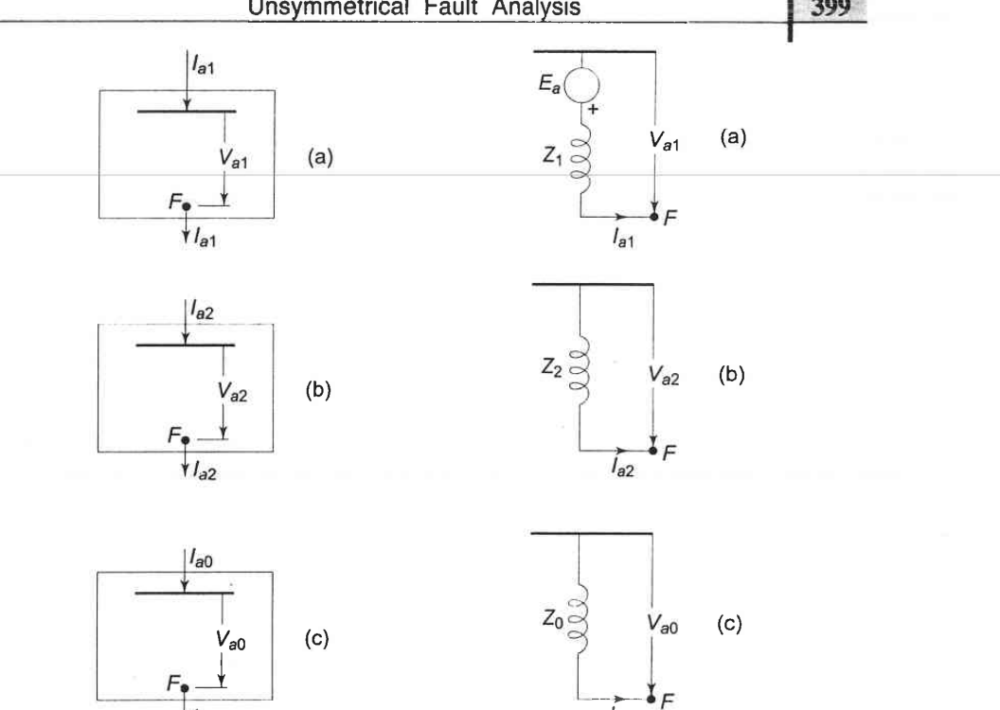

**Figure 2.6** — The three sequence networks of a general power system shown as blocks with terminals at F (left column), and their Thevenin equivalents looking back from F (right column): positive sequence has internal EMF E<sub>a</sub> in series with Z<sub>1</sub>; negative and zero sequences are impedances Z<sub>2</sub>, Z<sub>0</sub> to reference, with no EMFs. *Source: K&N Figs. 11.2 and 11.3, book p. 398, PDF p. 207.*

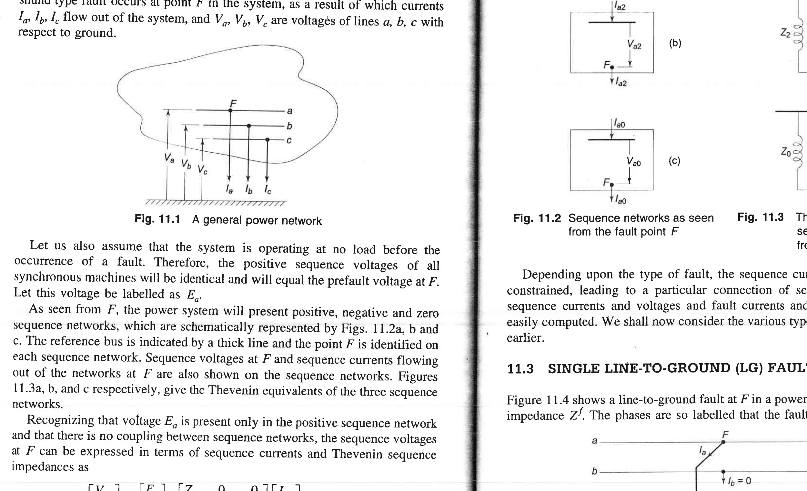

**Figure 2.7** — A general power network with a fault at point F on phase a; V<sub>a</sub>, V<sub>b</sub>, V<sub>c</sub> are line-to-ground voltages and I<sub>a</sub>, I<sub>b</sub>, I<sub>c</sub> are the currents out of the network at the fault. *Source: K&N Fig. 11.1, book p. 397, PDF p. 207.*

**Notation used (standard):**
- V<sub>f</sub> = prefault voltage at the fault bus (positive sequence only), usually 1∠0° pu.
- Z<sub>1</sub>, Z<sub>2</sub>, Z<sub>0</sub> = Thevenin impedances of the positive, negative, zero networks looking back from the fault point to the reference bus. Each includes the impedance of every generator, transformer, and line between the fault and all sources.
- Z<sub>f</sub> = fault impedance (e.g., arc resistance, tower-footing resistance). For a "solid" or "bolted" fault Z<sub>f</sub> = 0.
- Z<sub>g</sub> = neutral-to-ground impedance at the fault (for ground faults).

---

### 2.5.1 Single line-to-ground fault (LG) — phase a to ground

**Boundary conditions at the fault:** V<sub>a</sub> = 0 (solid fault, phase a grounded), I<sub>b</sub> = I<sub>c</sub> = 0 (phases b and c are healthy, carrying zero fault current).

**The network connection rule:** Connect the three sequence networks **in series** through the fault path, so that their currents are equal and their voltages sum to zero (through 3Z<sub>f</sub> because the fault path carries I<sub>a</sub> = I<sub>a1</sub> + I<sub>a2</sub> + I<sub>a0</sub> = 3 I<sub>a1</sub>, so the IZ drop is 3I<sub>a1</sub> Z<sub>f</sub>):
```
I_{a1} = I_{a2} = I_{a0} = V_f / (Z_1 + Z_2 + Z_0 + 3Z_f)                  (2.1)
V_{a1} = V_f - I_{a1} Z_1
V_{a2} = 0 - I_{a2} Z_2
V_{a0} = 0 - I_{a0} Z_0
```
Then recover phase currents via I<sub>p</sub> = A I<sub>s</sub>:
```
I_a = 3 I_{a1},     I_b = I_c = 0                                        (2.2)
```
(K&N Eqs. 11.6–11.10, book pp. 400–401.)

The corresponding connection diagram is K&N Fig. 11.4 (LG fault):

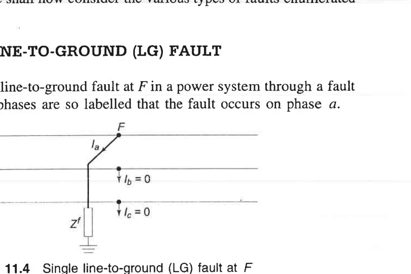

**Figure 2.8** — Single line-to-ground (LG) fault on phase a at point F: three networks in series through fault impedance Z<sub>f</sub> (the factor of 3 appears because all three sequence currents flow through the same fault path in the a-phase and return through ground). *Source: K&N Fig. 11.4, book p. 400, PDF p. 208.*

K&N then explicitly show the series connection with the Thevenin equivalents in Fig. 11.5 — this is the picture to memorize:

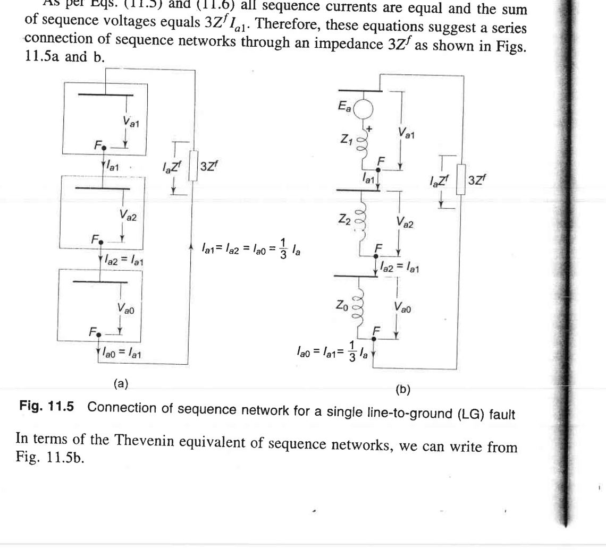

**Figure 2.8(bis)** — Connection of the three Thevenin-equivalent sequence networks for an LG fault: (a) in block form with I<sub>a1</sub> = I<sub>a2</sub> = I<sub>a0</sub> and a total fault-path drop of 3Z<sup>f</sup>I<sub>a1</sub>; (b) expanded to show E<sub>a</sub> in series with Z<sub>1</sub>, Z<sub>2</sub>, Z<sub>0</sub>, and 3Z<sup>f</sup>. *Source: K&N Fig. 11.5, book p. 401, PDF p. 208.*

> 🟡 *Why series?* The fault forces I<sub>b</sub> = I<sub>c</sub> = 0 ⇒ I<sub>a1</sub> = I<sub>a2</sub> = I<sub>a0</sub> (derive from A⁻¹ I<sub>p</sub> with I<sub>b</sub>=I<sub>c</sub>=0 — you'll find the three sequence currents equal). Equal currents means series connection.

The LG fault is often the *largest* fault current when the system is effectively grounded (Z<sub>0</sub> is small), because Z<sub>1</sub> + Z<sub>2</sub> + Z<sub>0</sub> can be smaller than the Z<sub>1</sub> that limits three-phase faults.

---

### 2.5.2 Line-to-line fault (LL) — phase b to phase c

**Boundary conditions:** I<sub>a</sub> = 0, I<sub>b</sub> = −I<sub>c</sub>, V<sub>b</sub> − V<sub>c</sub> = 0 (or V<sub>b</sub> − V<sub>c</sub> = I<sub>b</sub> Z<sub>f</sub> for a fault through Z<sub>f</sub>). These force I<sub>a0</sub> = 0 (since I<sub>a</sub> + I<sub>b</sub> + I<sub>c</sub> = 0) and I<sub>a1</sub> = −I<sub>a2</sub>.

**The network connection rule:** Connect positive and negative networks **in parallel** at the fault point; leave the zero-sequence network open (not involved, since there is no ground path):
```
I_{a1} = -I_{a2} = V_f / (Z_1 + Z_2 + Z_f)
I_{a0} = 0                                                                (2.3)
```
Phase currents: I<sub>a</sub> = 0, I<sub>b</sub> = −I<sub>c</sub> = (a² − a) I<sub>a1</sub> = −j√3 I<sub>a1</sub>. (K&N §11.4, book pp. 402–404.)

The connection is shown in K&N Figs. 11.7 and 11.8:

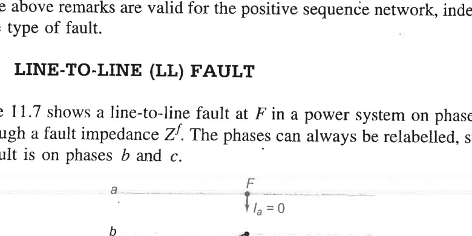

**Figure 2.9** — Line-to-line (LL) fault between phases b and c through fault impedance Z<sub>f</sub>. *Source: K&N Fig. 11.7, book p. 403, PDF p. 209.*

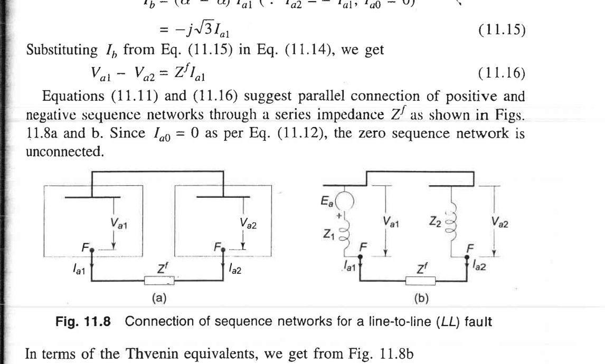

**Figure 2.10** — Connection of positive- and negative-sequence networks (in parallel opposition) for an LL fault; zero-sequence is open. *Source: K&N Fig. 11.8, book p. 403, PDF p. 209.*

> 🟡 *Physical sense:* No ground connection ⇒ no zero sequence. The fault just connects two phases together, which is why only positive and negative are involved.

---

### 2.5.3 Double line-to-ground fault (LLG) — phases b and c to ground

**Boundary conditions:** V<sub>b</sub> = V<sub>c</sub> = 0 (solid fault on both b and c to ground), I<sub>a</sub> = 0. These force V<sub>a1</sub> = V<sub>a2</sub> = V<sub>a0</sub> and I<sub>a1</sub> + I<sub>a2</sub> + I<sub>a0</sub> = 0.

**The network connection rule:** Connect the positive, negative, and zero networks **all in parallel** at the fault point:
```
I_{a1} = V_f / (Z_1 + Z_2 Z_0/(Z_2 + Z_0))
I_{a2} = -I_{a1} · Z_0/(Z_2 + Z_0)
I_{a0} = -I_{a1} · Z_2/(Z_2 + Z_0)                                       (2.4)
```
Phase b and c currents and the ground current I<sub>g</sub> = 3I<sub>a0</sub> are then obtained from A I<sub>s</sub>. (K&N §11.5, book pp. 404–410.)

The diagrams:

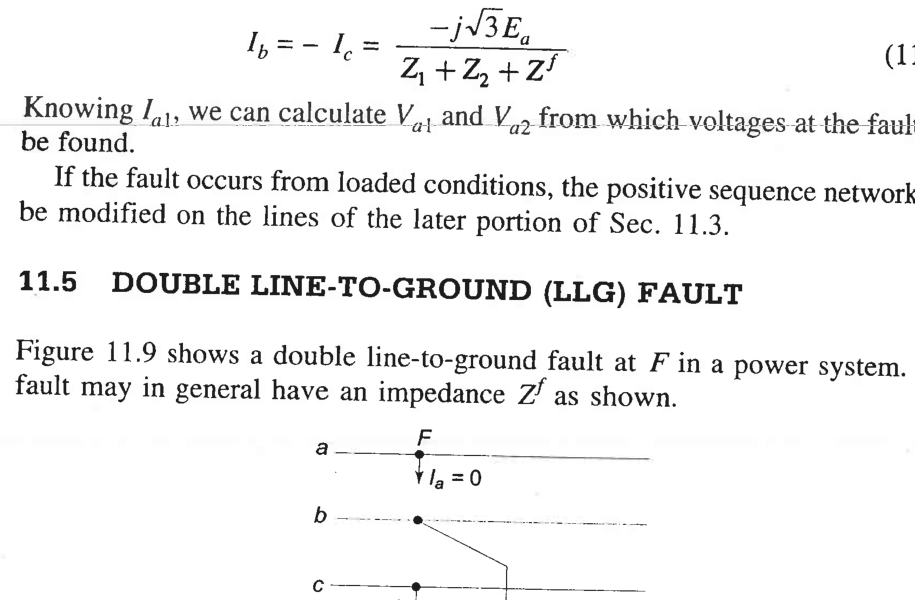

**Figure 2.11** — Double line-to-ground (LLG) fault on phases b and c. *Source: K&N Fig. 11.9, book p. 405, PDF p. 210.*

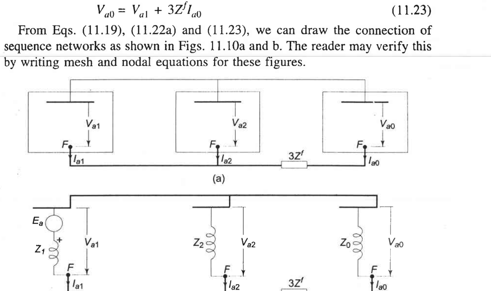

**Figure 2.12** — Connection of all three sequence networks in parallel for an LLG fault. *Source: K&N Fig. 11.10, book p. 405, PDF p. 210.*

> 🟡 *Why parallel?* The voltages at the fault are equal across sequences (V<sub>a1</sub> = V<sub>a2</sub> = V<sub>a0</sub>), and the currents sum to zero (I<sub>a1</sub> + I<sub>a2</sub> + I<sub>a0</sub> = 0). That is exactly Kirchhoff's laws for parallel branches tied between two nodes.

---

### 2.5.4 Open conductor faults (series)
For a phase-a conductor open (or with impedance Z), the boundary conditions are dual to the shunt cases: I<sub>a</sub> = 0 and V<sub>bb′</sub> = V<sub>cc′</sub> = 0 (if solidly open), leading to the **series connections** being parallel and vice versa. The sequence-network connection is shown in K&N Fig. 11.20:

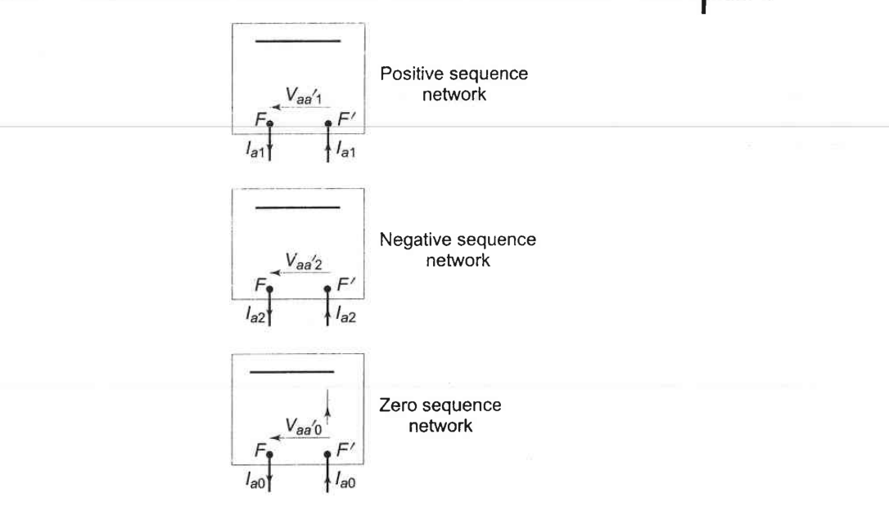

**Figure 2.13** — Sequence networks for an open-conductor fault at F–F′ (one conductor open): the networks are connected in parallel across the break (compare with shunt faults where connections were in series for LG). *Source: K&N Fig. 11.20, book p. 415, PDF p. 215.*

In practice you look these connection rules up rather than deriving each time; the pattern is consistent — one constraint ("currents equal" ⇒ series, "voltages equal" ⇒ parallel) tells you how to hook the networks together. (K&N §11.6, book pp. 414–416.)

---

### 2.5.5 Memory aid — the single most useful table

| Fault type | Sequence networks at fault point | Fault current (for Z<sub>f</sub>=0) |
|---|---|---|
| 3-phase (symmetrical) | Positive only (short) | I<sub>f</sub> = V<sub>f</sub>/Z<sub>1</sub> |
| Line-Ground (LG) | Z<sub>1</sub>, Z<sub>2</sub>, Z<sub>0</sub> **in series** | I<sub>a</sub> = 3 V<sub>f</sub>/(Z<sub>1</sub> + Z<sub>2</sub> + Z<sub>0</sub>) |
| Line-Line (LL) | Z<sub>1</sub> parallel Z<sub>2</sub>, Z<sub>0</sub> open | I<sub>b</sub> = −j√3 V<sub>f</sub>/(Z<sub>1</sub> + Z<sub>2</sub>) |
| Double-Line-Ground (LLG) | Z<sub>1</sub>, Z<sub>2</sub>, Z<sub>0</sub> **in parallel** | I<sub>b</sub>, I<sub>c</sub> from formulas; ground current = 3I<sub>a0</sub> |

> ⚠️ **Common misconception:** "The three-phase fault is always the worst (largest current)." Not true. In effectively grounded systems with small Z<sub>0</sub>, LG fault current can exceed 3-phase fault current — see for example K&N Example 11.4 (book pp. 408–410).

**❓ Understanding checkpoint:** For a bolted LG fault on a solidly-grounded system where Z<sub>1</sub> = Z<sub>2</sub> = j0.2 pu and Z<sub>0</sub> = j0.3 pu, what is I<sub>a</sub>?
  - *Answer:* I<sub>a</sub> = 3·1/(j0.2 + j0.2 + j0.3) = 3/(j0.7) = −j4.29 pu. Compare with a 3-phase fault: I<sub>f</sub> = 1/j0.2 = −j5 pu — in this case the 3-phase is larger, but if Z<sub>0</sub> were smaller (say j0.1), then LG would give 3/(j0.5) = −j6 pu, exceeding 3-phase.

---

## 2.6 Circuit-breaker ratings and current-limiting reactors 🔵 (engineering context)

### Why ratings matter
A circuit breaker must:
1. **Close** into a fault (and survive) — momentary duty, first-cycle asymmetrical current with DC offset.
2. **Interrupt** the fault current at a current zero a few cycles later — interrupting duty, typically at transient (X′<sub>d</sub>) current level.
3. **Withstand** the rated voltage across its open contacts after interruption — basically the system's rated voltage.

Breakers are rated in MVA (short-circuit MVA = √3 V<sub>rated</sub> I<sub>interrupting</sub>) and in kA of interrupting current; they must exceed the calculated fault MVA at their location.

### Current-limiting reactors
When a new generator or feeder is added to a station, the total fault current can exceed existing breaker ratings. Rather than replace every breaker, engineers add **current-limiting reactors** (large air-core inductors) in series with the bus or feeders. These add intentional series impedance, increasing Z<sub>th</sub> at the bus and reducing fault current to within breaker ratings. Reactors are sized by the percent reactance needed to bring fault MVA below the breaker rating, while not causing excessive voltage drop under normal load.

(K&N §9.5 end, book pp. 348–349.)

---

## 2.7 Worked example (small numbers, LG fault) 🟡

**Problem:** A generator (X″<sub>d</sub> = X<sub>2</sub> = j0.15 pu, X<sub>0</sub> = j0.05 pu) is connected to a bus through a Y<sub>g</sub>-Δ transformer (X = j0.1 pu). The high-voltage bus is solidly grounded. A solid LG fault occurs on the HV side of the transformer. Neglect prefault load (V<sub>f</sub> = 1∠0° pu). Find the fault current.

**Step-by-step reasoning:**
1. Build the Thevenin impedances from the fault point looking back:
   - Z<sub>1</sub> = X<sub>transformer</sub> + X″<sub>d</sub> = j0.1 + j0.15 = j0.25 pu.
   - Z<sub>2</sub> = X<sub>transformer</sub> + X<sub>2</sub> = j0.1 + j0.15 = j0.25 pu.
   - Z<sub>0</sub>: The zero-sequence path from the HV (Y-grounded) side goes through the transformer leakage to the Δ, where it is shorted to the zero-sequence reference (because Δ circulates I<sub>0</sub> but blocks it from reaching the generator). So Z<sub>0</sub> = X<sub>transformer</sub> = j0.1 pu (the generator Z<sub>0</sub> is on the Δ side and not "seen" from the HV lines).
2. For a solid LG fault, use Eq. (2.1):
   - I<sub>a1</sub> = 1/(j0.25 + j0.25 + j0.1) = 1/(j0.6) = −j1.667 pu.
3. Phase a fault current = 3 I<sub>a1</sub> = −j5.0 pu.
4. Ground current = I<sub>n</sub> = 3 I<sub>a0</sub> = 3(−j1.667) = −j5.0 pu (same as I<sub>a</sub>, since only phase a is faulted).

**🟡 Does this make sense?** Notice that Z<sub>0</sub> is small (j0.1), dominated by the transformer leakage (the delta effectively shorts zero sequence from the HV side). This makes the LG fault larger than if zero-sequence had to cross into the generator. If the transformer were Y<sub>g</sub>-Y<sub>g</sub> ungrounded on the generator side, Z<sub>0</sub> would be open (infinite) and LG fault current would be zero — the system would be ungrounded.

---

## 2.8 Unit II self-check

1. Why does a synchronous generator have three different reactances (X″<sub>d</sub>, X′<sub>d</sub>, X<sub>d</sub>)?
   - *Because the damper windings and field winding trap flux initially and decay over time, making the machine look successively "stiffer" (larger reactance) as transients decay.*
2. Which sequence network is the only one with voltage sources?
   - *Positive.*
3. For a bolted LG fault, how are the three sequence networks connected?
   - *In series.*
4. For a bolted LL fault, which sequence network is not involved?
   - *Zero sequence (no ground path).*
5. Why is a Y<sub>g</sub>-Δ transformer a "zero-sequence ground source" on the Y side?
   - *Because the Δ provides a short-circuited path for zero-sequence current to circulate, so zero-sequence on the Y side sees a short to reference through leakage impedance — making the Y-grounded neutral an effective zero-sequence ground.*

---

### Practice problems (answers only — solve on your own)

**P1.** (3-phase fault) A generator (100 MVA, X″<sub>d</sub> = j0.15 pu on 100 MVA) feeds through a transformer (100 MVA, X = j0.1 pu) and a line (X = j0.3 pu on 100 MVA) to a bus where a solid 3-phase fault occurs. Find the fault current magnitude in pu on 100 MVA, fault MVA, and fault current in amperes at the 220 kV line voltage.
  - *Final answers:* Z<sub>th</sub> = j0.55 pu; I<sub>f</sub> = 1.82 pu; S<sub>f</sub> ≈ 182 MVA; I<sub>f</sub> ≈ 477 A at 220 kV.

**P2.** (DC offset) An R-L circuit has X/R = 20. A fault occurs at voltage zero (the worst instant for DC offset). What is the ratio of the first peak asymmetrical current to the symmetrical peak?
  - *Final answer:* Roughly 1 + e<sup>−(π/(X/R))</sup> = 1 + e<sup>−0.157</sup> ≈ 1.85, i.e. the first peak is ~1.85× the symmetrical peak — that's why breakers have a separate "momentary" rating.

**P3.** (LG fault, easy numbers) At a fault bus, Z<sub>1</sub> = Z<sub>2</sub> = j0.2 pu, Z<sub>0</sub> = j0.1 pu (solidly grounded system, V<sub>f</sub> = 1∠0°). Find the LG fault current and compare it to the 3-phase fault current.
  - *Final answers:* I<sub>a</sub>(LG) = 3/(j0.5) = −j6.0 pu; I<sub>f</sub>(3φ) = 1/j0.2 = −j5.0 pu. Here LG exceeds 3φ (because Z<sub>0</sub> < Z<sub>1</sub>), illustrating that "three-phase is always worst" is false.

**P4.** (LL fault) For the same Z<sub>1</sub> = Z<sub>2</sub> = j0.2 pu, Z<sub>0</sub> = j0.1 pu, find the fault current in phase b for a bolted LL fault on phases b and c.
  - *Final answer:* |I<sub>b</sub>| = √3/(0.4) = 4.33 pu — smaller than both 3-phase (5 pu) and LG (6 pu) at this bus.

**P5.** (Fault impedance effect) For the bus in P3, add a fault impedance Z<sub>f</sub> = j0.1 pu (e.g. arc resistance + tower footing resistance, approximated as inductive). By what factor does the LG fault current decrease?
  - *Final answers:* I<sub>a</sub> = 3/(j0.5 + j0.3) = −j3.75 pu; the current drops to 3.75/6.0 = 0.625 (a 37.5% reduction) — fault impedance matters enormously for ground-fault duty.

**P6.** (Breaker sizing) At a station bus, the calculated symmetrical interrupting duty is 40 kA rms at 132 kV. What is the required symmetrical interrupting MVA rating of the breaker?
  - *Final answer:* √3 × 132 × 40 ≈ 9145 MVA → a 10 kA-class breaker is far too small; you would specify a 40 kA / ~10,000 MVA class breaker, or add current-limiting reactors.
