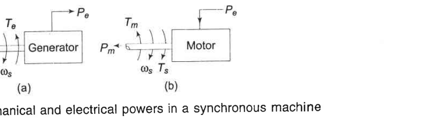
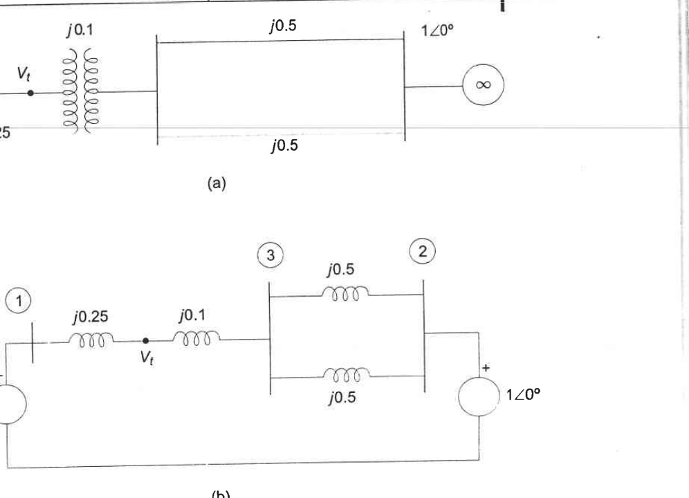
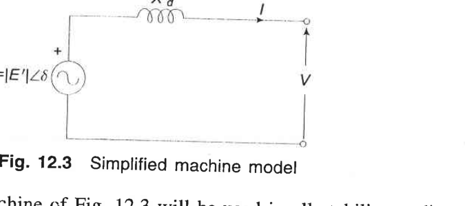
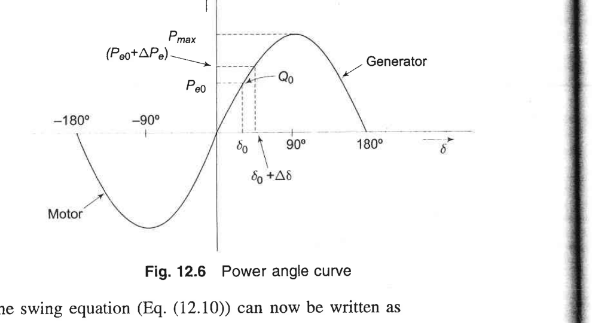
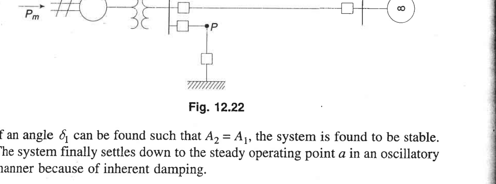
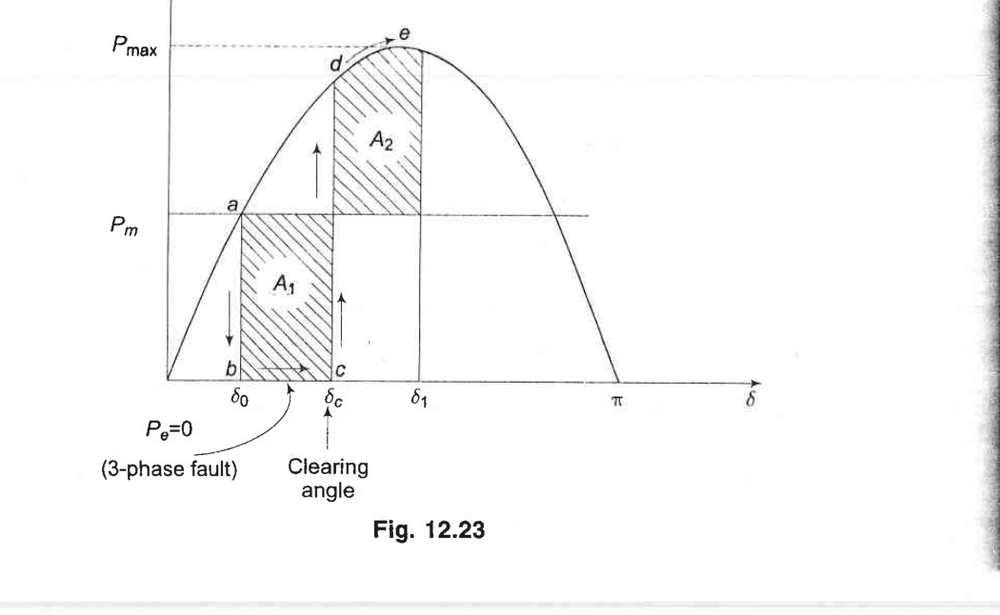
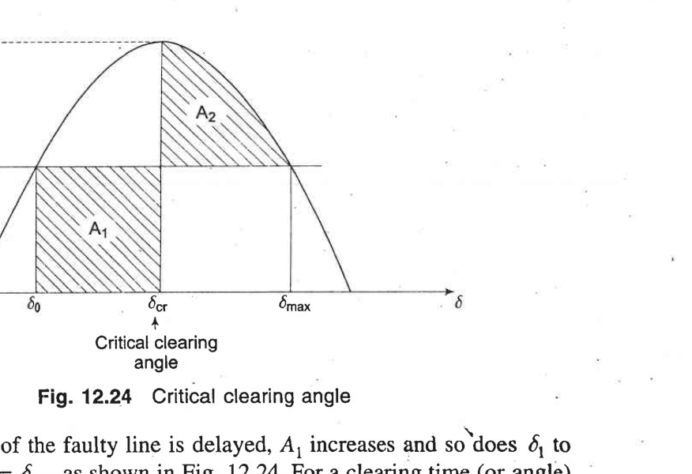
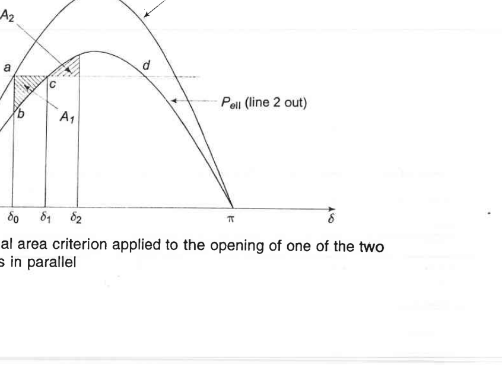

# Unit III — Power System Stability

> *Why this unit exists:* Faults are cleared by circuit breakers in a few cycles, but the immediate question after clearing is: *Do the generators stay in synchronism with one another?* A generator is a multi-ton rotating mass; if the electromagnetic torque pulling it back into sync with the grid is insufficient after a disturbance, it "slips a pole," currents go wild, protection trips the machine off-line, and cascading blackouts can follow. Stability analysis answers the question "will the system survive this disturbance?"
>
> Source: K&N Ch. 12 (book pp. 433–508; PDF pp. 225–280).

---

## 3.1 What "stability" means in plain words 🟡

Imagine a bicycle. When you're rolling straight at a good speed, small bumps or gusts of wind don't knock you over — you (actively or passively) correct and keep going. If the bump is big enough, you wobble and may fall.

A power system works the same way. Generators are rotating masses (like the bike), and the electromagnetic coupling between them (like the rider's sense of balance) provides a restoring torque when something disturbs them. A system is **stable** for a given disturbance if, after the disturbance, all generators settle back into a new synchronous operating state.

K&N distinguish three categories (book pp. 433–434):

- **Steady-state stability** — the system's ability to remain in sync under *small, gradual* changes in load (small-signal stability). This is essentially a question of whether dP/dδ > 0 at the operating point (see §3.3).
- **Dynamic stability** — stability under small disturbances but considering excitation-system controls and damping (not covered in depth in these notes beyond a mention).
- **Transient stability** — stability after a *large* disturbance (a fault, a line trip, a sudden load application). Here rotor angles may swing by large amounts, and we must answer: do they reach a new equilibrium, or do they keep increasing (pole slip)?

> 🟡 *Why engineers care:* Blackouts (e.g., the 2003 Northeast blackout, 2012 India blackouts) are almost always transient stability failures — a fault was not cleared quickly enough, or the system after clearing was too weak to hold the generators in sync.

---

## 3.2 The swing equation — Newton's law for a generator rotor 🔴 Slow down

### Physical picture
A synchronous generator's rotor is a massive spinning cylinder with moment of inertia J. In steady state it rotates at synchronous speed ω<sub>s</sub> (in electrical radians per second: ω<sub>s</sub> = 2πf, e.g., 314 elec. rad/s at 50 Hz, 377 elec. rad/s at 60 Hz). The mechanical torque T<sub>m</sub> from the turbine drives it forward; the electromagnetic torque T<sub>e</sub> from stator currents (the load) pulls it back. If T<sub>m</sub> = T<sub>e</sub>, speed is constant and the rotor angle δ (the angle between the rotor's internal EMF and the system voltage) is constant.



**Figure 3.1** — Flow of mechanical and electrical power in a synchronous machine: (a) generator — mechanical torque T<sub>m</sub> turns the shaft, electrical power P<sub>e</sub> flows out; (b) motor — mechanical power P<sub>m</sub> flows out, shaft torque T<sub>s</sub> drives the load. *Source: K&N Fig. 12.1, book p. 435, PDF p. 226.*

When there is a mismatch between T<sub>m</sub> and T<sub>e</sub>, the rotor accelerates or decelerates per Newton's second law for rotation:
```
J d²θ_m/dt² = T_m - T_e                                                    (3.1)
```
where θ<sub>m</sub> is the rotor's mechanical angle. In power systems we work with electrical angles and with power (not torque) because we measure power directly. Multiplying both sides by ω<sub>m</sub> (mechanical speed) converts torque to power, and we convert mechanical angle to electrical angle (multiplying by the number of pole-pairs p/2).

Defining **rotor angle δ** = electrical angle by which the rotor leads the synchronously-rotating reference frame, and using the inertia constant H (see below), we get the **swing equation**:
```
M d²δ/dt² = P_m - P_e = P_a                                               (3.2)
```
where
- M = inertia coefficient (inertia), with units of MW·s/elec. rad or in pu,
- P<sub>m</sub> = mechanical shaft power input (from turbine) in pu,
- P<sub>e</sub> = electrical air-gap power output (electrical power delivered to the system) in pu,
- P<sub>a</sub> = accelerating power.

(K&N Eqs. 12.7–12.9 near book p. 436, PDF p. 226.)

If P<sub>m</sub> > P<sub>e</sub>, P<sub>a</sub> is positive and the rotor *accelerates* (δ increases); if P<sub>m</sub> < P<sub>e</sub>, the rotor *decelerates* (δ decreases).

### The inertia constant H (🟡 pay attention)
Rather than carry J around (which varies wildly with machine size), power engineers define:
```
H = (stored kinetic energy at synchronous speed in MJ) / (machine rating in MVA)
```
H is measured in MJ/MVA (or MW·s/MVA, same thing). Typical values from K&N Table 12.1 (book p. 437):
- Steam turbogenerator: 3–10 MJ/MVA (H bigger because the turbine adds inertia).
- Water-wheel (hydro) generator, slow-speed: 2–3 MJ/MVA.
- Synchronous condenser (no turbine): 1–1.5 MJ/MVA.

H is a property of the physical machine design and is far less variable across ratings than J is. In terms of H (in pu on the machine base),
```
M (pu) = 2H / ω_s     in s²/elec. rad                                    (3.3)
```
(K&N Eqs. 12.17–12.18, book p. 437.)

**❓ Understanding checkpoint:** If two identical generators are on the same shaft (cross-compound unit), is their combined H the sum, average, or something else?
  - *Answer:* H adds directly, because both the stored energy (numerator) and the MVA rating (denominator) add. Tightly coupled machines can be represented by a single swing equation with total H = H<sub>1</sub> + H<sub>2</sub>.

---

## 3.3 The power-angle equation — the key curve for everything in Unit III 🔴 Slow down

### Physical picture (why a generator delivers power as sin δ)
Consider a simple system: a generator with internal voltage E (a voltage source behind X′<sub>d</sub>) connected through total series reactance X to an "infinite bus" — a very large grid whose voltage V is fixed in magnitude and angle (think "rest of the system"). K&N's standard example (Fig. 12.7) is a generator with X′<sub>d</sub> = j0.25 pu, a transformer of j0.1 pu, and two parallel transmission lines of j0.5 pu each feeding an infinite bus at 1∠0°:



**Figure 3.2(bis)** — K&N's standard one-machine infinite-bus (OMIB) example system: (a) pre-fault with both parallel lines in service; (b) reduced circuit showing X′<sub>d</sub>, transformer, and the parallel-line equivalent. When one line is tripped post-fault, the transfer reactance rises from X<sub>pre</sub> = 0.25 + 0.1 + (0.5 ∥ 0.5) = 0.6 pu to X<sub>post</sub> = 0.25 + 0.1 + 0.5 = 0.85 pu, lowering P<sub>max,post</sub>. *Source: K&N Fig. 12.7, book p. 450, PDF p. 233.*

This is the **one-machine infinite-bus (OMIB)** model:



**Figure 3.2** — Simplified machine model: a voltage source |E′|∠δ behind series reactance X′<sub>d</sub> connected to an infinite bus V∠0°. *Source: K&N Fig. 12.3, book p. 442, PDF p. 230.*

The current from generator to bus is I = (E∠δ − V∠0°)/(jX). The real power delivered is P<sub>e</sub> = Re[E I*]:
```
P_e(δ) = (E V / X) sin δ                                                  (3.4)
```
(K&N Eq. 12.26, book p. 442.) This is the **power-angle curve** — a sine function of δ.

### In words, in pictures, in equations
- *In words:* If the rotor angle δ is 0° (rotor aligned with the system voltage), the machine delivers no real power. As the rotor pushes ahead (δ increases), the electromagnetic "spring" between rotor and stator delivers more power, peaking at δ = 90° where P<sub>max</sub> = EV/X. Beyond 90°, pushing the rotor further forward actually delivers *less* power — the magnetic coupling is being over-stretched.
- *In a diagram:* plot δ on the horizontal axis, P<sub>e</sub> on the vertical axis. The curve is a sine wave starting at (0,0), peaking at (90°, EV/X), and returning to zero at 180° (and symmetrically negative for motor operation with δ < 0). The mechanical power P<sub>m</sub> (set by the turbine) is a horizontal line — the operating point is where they intersect:



**Figure 3.3** — Power-angle curve P<sub>e</sub>(δ) = P<sub>max</sub> sin δ for a cylindrical-rotor machine (generator for 0 < δ < 180°, motor for −180° < δ < 0), with the initial operating point at δ<sub>0</sub> and a small perturbation δ<sub>0</sub> + Δδ. *Source: K&N Fig. 12.6, book p. 449, PDF p. 233.*

- *In an equation:* Eq. (3.4).

### Why dP/dδ matters for steady-state stability 🟡
At an equilibrium point P<sub>m</sub> = P<sub>e</sub>(δ<sub>0</sub>), if δ strays a little above δ<sub>0</sub>:
- If dP<sub>e</sub>/dδ > 0 at δ<sub>0</sub> (i.e., δ<sub>0</sub> < 90°), then P<sub>e</sub> increases above P<sub>m</sub>, so P<sub>a</sub> = P<sub>m</sub> − P<sub>e</sub> becomes negative, decelerating the rotor back toward δ<sub>0</sub>. **Stable.**
- If dP<sub>e</sub>/dδ < 0 (i.e., δ<sub>0</sub> > 90°), then P<sub>e</sub> *decreases* when δ increases, so P<sub>a</sub> becomes positive, accelerating the rotor further. **Unstable** — the rotor slips.

The **steady-state stability limit** is P<sub>max</sub> = EV/X, reached at δ = 90°. In steady state a generator must operate with δ well below 90° (typically 30–45°) to leave margin.

> ⚠️ **Common misconception:** "The generator works like a DC motor where more torque = more speed." No, in a synchronous machine, mechanical power changes are balanced by changes in *rotor angle δ*, not speed — at steady state the machine always runs at synchronous speed (50/60 Hz). P<sub>m</sub> going up pushes δ up until P<sub>e</sub> matches at the new angle.

---

## 3.4 The equal-area criterion — a beautiful geometric shortcut 🔴

### Setup
For a one-machine infinite-bus (OMIB) system, or two-machine systems reduced to an equivalent, we can judge transient stability *without* solving the swing equation numerically by using the **equal-area criterion**. This works because the swing equation (with no damping) is a conservative system, similar to a pendulum, where kinetic energy gained during acceleration must be absorbed during deceleration.

### The physical reasoning
Imagine a system initially in equilibrium at δ<sub>0</sub> with P<sub>m</sub> = P<sub>e,pre</sub>(δ<sub>0</sub>). K&N's one-line diagram for the typical case (a generator connected through double-circuit lines to an infinite bus, with a fault on one of the lines) is Fig. 12.22:



**Figure 3.4** — One-machine infinite-bus system with a fault at point P on one of two parallel lines. *Source: K&N Fig. 12.22, book p. 466, PDF p. 242.*

A fault occurs at t = 0; during the fault, the electrical power P<sub>e</sub>(δ) is smaller (because the fault is a near-short), so P<sub>a</sub> = P<sub>m</sub> − P<sub>e</sub> is positive and the rotor accelerates, δ increasing. At t = t<sub>c</sub> (clearing time), breakers clear the fault by opening a line, and the post-fault power-angle curve P<sub>e,post</sub>(δ) is restored (possibly reduced from pre-fault because a line is now out). After clearing, P<sub>e</sub> may exceed P<sub>m</sub>, decelerating the rotor.

**Stability criterion:** For the rotor to "swing up" and come back, the **accelerating area** (the area between P<sub>m</sub> and P<sub>e,during</sub>, from δ<sub>0</sub> to δ<sub>c</sub>) must be ≤ the **decelerating area** (the area between P<sub>e,post</sub> and P<sub>m</sub>, from δ<sub>c</sub> to δ<sub>max</sub> where P<sub>e,post</sub> again crosses P<sub>m</sub> going down).

The equal-area picture (for the worst case P<sub>e,during</sub> = 0, a solid three-phase fault at the generator terminals) is shown in K&N Fig. 12.23:



**Figure 3.5** — Equal-area criterion for a three-phase fault (P<sub>e</sub> = 0 during the fault): A<sub>1</sub> (shaded lower) is the accelerating area gained while δ swings from δ<sub>0</sub> to δ<sub>c</sub>; A<sub>2</sub> (shaded upper) is the decelerating area available between δ<sub>c</sub> and δ<sub>max</sub> = δ<sub>1</sub>. For stability we need A<sub>2</sub> ≥ A<sub>1</sub>. *Source: K&N Fig. 12.23, book p. 466, PDF p. 243.*

### In equations
The equal-area criterion is (K&N Eq. 12.71, book p. 465):
```
∫_{δ_0}^{δ_c} (P_m - P_{e,during}) dδ  =  ∫_{δ_c}^{δ_max} (P_{e,post} - P_m) dδ   (3.5)
```
Both sides have units of (power × angle) — energy, essentially. The left side is kinetic energy gained during acceleration; the right is kinetic energy that can be absorbed during deceleration before δ reaches the unstable equilibrium point δ<sub>max</sub>. If we set them equal, we solve for the **critical clearing angle** δ<sub>cr</sub> (and hence critical clearing time t<sub>cr</sub>): if the fault is cleared before δ reaches δ<sub>cr</sub>, the system is stable; after, it is unstable.



**Figure 3.6** — Critical clearing angle δ<sub>cr</sub>: the clearing angle at which A<sub>1</sub> = A<sub>2</sub> exactly. Clearing at δ<sub>c</sub> < δ<sub>cr</sub> leaves A<sub>2</sub> > A<sub>1</sub> (stable); clearing after δ<sub>cr</sub> leaves A<sub>2</sub> < A<sub>1</sub> (unstable, δ runs away past 180°). *Source: K&N Fig. 12.24, book p. 467, PDF p. 244.*

> 🟡 *Why not just simulate?* For a one-machine system the equal-area criterion gives a closed-form answer and, more importantly, deep intuition — you can *see* on the P-δ diagram how raising P<sub>m</sub>, weakening the post-fault network (lowering P<sub>max,post</sub>), or delaying clearing shrinks the decelerating area relative to the accelerating area.

### Applications (K&N §12.9, book pp. 468–486)
The equal-area criterion is applied to:
1. **Sudden change in mechanical input** (step increase of P<sub>m</sub>) — pure step test.
2. **Fault with one line switched out** (fault-on, line-open post-fault).
3. **Fault with auto-reclosing** (brief open, then reclose; if the fault is transient the system recovers, if permanent it retrips).
4. **Line switching without fault**.

Each application just changes what P<sub>e,during</sub>(δ) and P<sub>e,post</sub>(δ) curves look like; the stability question is always whether the decelerating area can contain the accelerating area. A representative case — fault on one of two parallel lines, with the faulted line switched out to clear — is shown in K&N Fig. 12.26:



**Figure 3.6(bis)** — Equal-area criterion applied to a fault cleared by opening one of two parallel lines: three P-δ curves are drawn — pre-fault (highest P<sub>max</sub>), during-fault (lowest, zero for a bolted 3-phase fault), and post-fault (intermediate, one line still in service, labelled P<sub>eII</sub> "line 2 out"). The angles δ<sub>0</sub> (initial), δ<sub>1</sub> (clearing), δ<sub>2</sub> (maximum swing), and shaded areas A<sub>1</sub> (accelerating) and A<sub>2</sub> (decelerating) are shown. *Source: K&N Fig. 12.26, book p. 472, PDF p. 245.*

### Worked example (small numbers, equal-area) 🟡

**Problem:** A generator with E = 1.2 pu is connected through a total pre-fault reactance X<sub>pre</sub> = 0.4 pu to an infinite bus at V = 1.0 pu. A three-phase fault at the generator terminals drops P<sub>e</sub> to zero during the fault. The fault is cleared by opening a line so the post-fault reactance becomes X<sub>post</sub> = 0.6 pu. The initial mechanical input is P<sub>m</sub> = 1.5 pu. Find whether the system is stable if the fault is cleared when δ<sub>c</sub> = 60°.

**Step-by-step reasoning:**

1. **Find the pre-fault operating point δ<sub>0</sub>.** Before the fault, P<sub>e,pre</sub>(δ) = (E V / X<sub>pre</sub>) sin δ = (1.2·1/0.4) sin δ = 3 sin δ. Setting this equal to P<sub>m</sub> = 1.5 gives sin δ<sub>0</sub> = 1.5/3 = 0.5, so δ<sub>0</sub> = 30° (0.524 rad). *We take the smaller angle — that's the stable equilibrium (dP/dδ > 0).*

2. **Identify the three curves:**
   - During the fault: P<sub>e,during</sub>(δ) = 0 (a bolted 3-phase fault right at the terminals is the worst case).
   - After clearing: P<sub>e,post</sub>(δ) = (1.2·1/0.6) sin δ = 2 sin δ; P<sub>max,post</sub> = 2 pu.

3. **Find the post-fault unstable equilibrium δ<sub>max</sub>.** This is where P<sub>e,post</sub> = P<sub>m</sub> again, at δ > 90°: sin δ<sub>max</sub> = 1.5/2 = 0.75, so δ<sub>max</sub> = 180° − 48.6° = 131.4° (2.29 rad).

4. **Compute the accelerating area A<sub>1</sub>.** Because P<sub>e,during</sub> = 0, this is just a rectangle:
   ```
   A1 = ∫_{δ0}^{δc} Pm dδ = Pm (δc − δ0) = 1.5 · (60° − 30°) in rad
      = 1.5 · (π/6) = 0.785 pu·rad
   ```

5. **Compute the available decelerating area A<sub>2</sub>.** Between δ<sub>c</sub> and δ<sub>max</sub>, P<sub>e,post</sub> > P<sub>m</sub>:
   ```
   A2 = ∫_{δc}^{δmax} (Pmax,post sin δ − Pm) dδ
      = Pmax,post (cos δc − cos δmax) − Pm (δmax − δc)
   ```
   Converting to radians: δ<sub>c</sub> = 60° = 1.047 rad; δ<sub>max</sub> = 2.294 rad.
   ```
   cos 60° = 0.5
   cos 131.4° = cos(180° − 48.6°) = −cos 48.6° = −0.661
   A2 = 2 · (0.5 − (−0.661)) − 1.5 · (2.294 − 1.047)
      = 2 · 1.161 − 1.5 · 1.247
      = 2.322 − 1.871 = 0.451 pu·rad
   ```

6. **Compare:** A<sub>1</sub> = 0.785 > A<sub>2</sub> = 0.451. **The system is unstable** for δ<sub>c</sub> = 60° — the rotor gains more kinetic energy during the fault than can be absorbed after clearing.

7. **Bonus — find the critical clearing angle:** set A<sub>1</sub> = A<sub>2</sub> with δ<sub>c</sub> = δ<sub>cr</sub>:
   ```
   Pm (δcr − δ0) = Pmax,post (cos δcr − cos δmax) − Pm (δmax − δcr)
   ⇒ Pm (δmax − δ0) = Pmax,post (cos δcr − cos δmax)
   ⇒ cos δcr = (Pm (δmax − δ0))/Pmax,post + cos δmax
               = (1.5·(2.294 − 0.524))/2 + (−0.661)
               = 1.328 − 0.661 = 0.667
   ⇒ δcr ≈ 48°  (≈ 0.84 rad)
   ```
   Clearing at 60° is well past the 48° critical angle — instability confirmed.

**🟡 Does this make sense?** P<sub>m</sub> = 1.5 pu is 75% of the post-fault maximum (2 pu), which is a very high initial loading. That leaves little decelerating margin — the rotor can only swing 30° past δ<sub>c</sub> before hitting the unstable equilibrium. Faster clearing (smaller δ<sub>c</sub>) or stronger post-fault ties (larger P<sub>max,post</sub>) would shrink A<sub>1</sub> and enlarge A<sub>2</sub>.

---

## 3.5 Point-by-point (step-by-step) solution 🔵 Routine

For multimachine systems (more than one machine against an infinite bus, or two machines not reducible to a single equivalent), the equal-area criterion no longer gives closed-form answers and we integrate the swing equation numerically. K&N §12.10 gives the standard method: discretize time into steps Δt (typically 0.01–0.05 s, i.e., half-cycle to a few cycles), assume P<sub>a</sub> is constant within each step, update ω, then δ, and repeat. The resulting δ(t) plot is the **swing curve**. If δ for any machine increases without bound (monotonically, past 180° and beyond), that machine is unstable and will lose synchronism.

The update rule (classical method):
```
ω_{k+1} = ω_k + (Δt/M) · P_{a,k}
δ_{k+1} = δ_k + Δt · ω_{k+1}
```
with P<sub>a,k</sub> = P<sub>m</sub> − P<sub>e</sub>(δ<sub>k</sub>) evaluated at each step. (K&N Eqs. 12.80–12.85, book p. 488 onward.)

---

## 3.6 Methods of improving transient stability 🟡

Any change that increases the decelerating area or decreases the accelerating area improves stability:

1. **Faster fault clearing** — smaller δ<sub>c</sub>, less kinetic energy gained. This is why high-voltage breakers are rated for 2-cycle or 3-cycle clearing.
2. **Higher excitation voltages (forced excitation)** — raises E, raising P<sub>max,post</sub> and decelerating area.
3. **Fast valving** on turbines — quickly reduces P<sub>m</sub> after a fault, shrinking accelerating area.
4. **Braking resistors** — temporarily insert a large resistor at the generator bus to absorb excess power during the swing, increasing P<sub>e</sub>.
5. **Single-pole switching** — trip only the faulted phase (for LG faults) rather than all three, leaving more lines in service and keeping X lower post-fault.
6. **Stronger transmission** (more lines, series compensation) — raises P<sub>max</sub> = EV/X.
7. **Dynamic voltage support** (SVCs, STATCOMs) at key buses — supports voltage during faults, keeping P<sub>e</sub> higher.
8. **Proper system design** (avoiding weak ties between large areas, controlled islanding).

---

## 3.7 Unit III self-check

1. What does δ represent physically?
   - *The angle by which the generator's rotor (internal EMF) leads the synchronously rotating reference frame (the system voltage). It measures how "stretched" the magnetic coupling between rotor and stator is.*
2. At steady state, what is P<sub>m</sub> − P<sub>e</sub>?
   - *Zero. Accelerating power is zero; speed is constant; δ is constant.*
3. Why is P<sub>max</sub> = EV/X at δ = 90°?
   - *It comes directly from solving P<sub>e</sub> = Re[V I*] with I = (E∠δ − V)/jX — a standard AC power-transfer result.*
4. What does the equal-area criterion compare?
   - *Kinetic energy gained by the rotor during acceleration (accelerating area) versus the kinetic energy that can be absorbed while decelerating to the new stable equilibrium (decelerating area).*
5. If fault clearing is delayed, does the critical clearing angle get larger or smaller?
   - *That's a trick question — the critical clearing angle is a fixed value for a given system/fault; delaying clearing past that angle is what makes the system unstable. The longer the clearing time, the more δ has already increased past δ<sub>cr</sub>, and the more certain instability becomes.*
