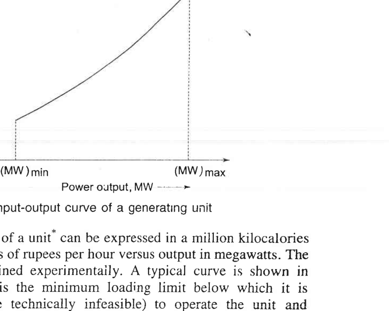
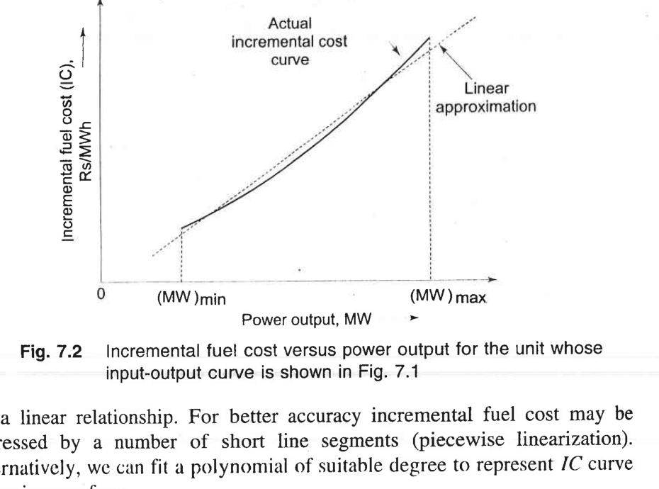
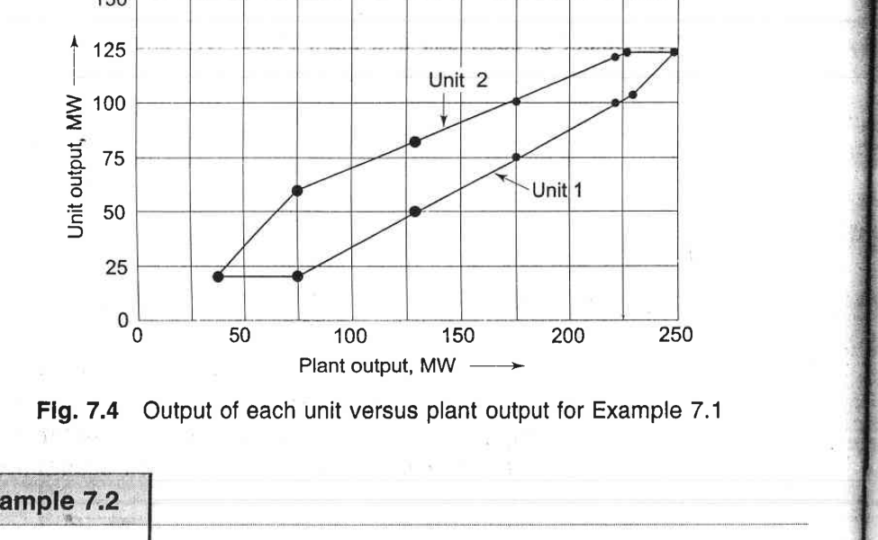
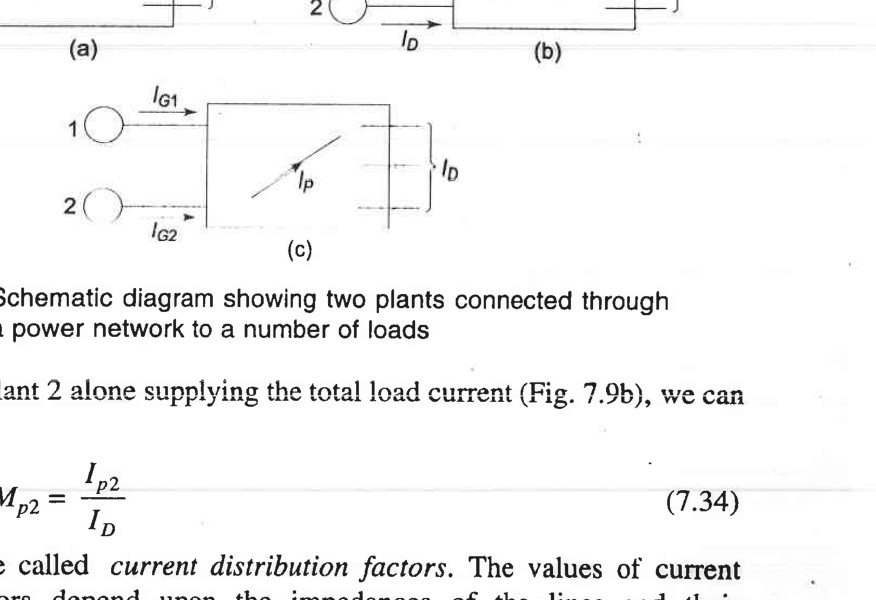

# Unit IV — Economic Operation of Power Systems

> *Why this unit exists:* Once the system is running stably, we still have to decide *which* of the many generators on the grid should produce how much power. The fuel bill dominates operating cost; a percent or two in efficiency is hundreds of millions of rupees/dollars per year. Economic dispatch (ED) finds the minimum-cost combination of generator outputs that meets the load.
>
> Source: K&N Ch. 7 (book pp. 242–284; PDF pp. 129–152). Hydrothermal scheduling (§7.7) is mentioned only briefly since the syllabus focuses on thermal economic dispatch.

---

## 4.1 The problem in plain language 🟡

Suppose you have two coal-fired generators, A and B, feeding the same load through a lossless bus. Generator A is old, inefficient at low output, and expensive to run; generator B is newer, flatter in efficiency, cheaper per MWh. If the total load is 200 MW, how should you split it between A and B to minimize total $/hour?

Naive answer: run the cheaper one at full output, let the other pick up the remainder. That turns out to be *almost* right but not exactly — the correct condition involves **marginal** costs, not total or average costs. This is the equal incremental-cost rule.

And in real systems the transmission lines lose some energy as heat (2–5% of total generation), so a generator electrically close to the load "wastes less" power getting the energy there. That effect introduces **penalty factors** via the loss-formula (B-coefficients).

---

## 4.2 Generator cost curves and incremental cost 🟡

### Input-output and incremental cost
Each thermal unit has an **input-output curve** C<sub>i</sub>(P<sub>i</sub>): cost per hour (in Rs/h or $/h) to produce P<sub>i</sub> MW, accounting for fuel plus other variable costs. This curve is monotonically increasing and slightly convex (cost rises faster than linearly at high output because of declining efficiency).



**Figure 4.1** — Input-output curve of a generating unit: fuel input (Rs/h or Mkcal/h) versus power output P (MW), with minimum and maximum loading limits (MW)<sub>min</sub> and (MW)<sub>max</sub>. *Source: K&N Fig. 7.1, book p. 243, PDF p. 130.*

For analytical convenience, C<sub>i</sub> is usually approximated by a quadratic:
```
C_i(P_i) = a_i + b_i P_i + c_i P_i²        Rs/h         (4.1)
```
where a<sub>i</sub>, b<sub>i</sub>, c<sub>i</sub> are constants fit to measured data. P<sub>i</sub> is in MW. (K&N Eq. 7.2, book p. 243.)

The **incremental fuel cost** (marginal cost) of generator i is the cost of producing *one more MW*:
```
IC_i(P_i) = dC_i/dP_i = b_i + 2c_i P_i     Rs/MWh       (4.2)
```
It is a straight, upward-sloping line when C<sub>i</sub> is quadratic.



**Figure 4.2** — Incremental fuel cost (IC) curve for a typical thermal unit: upward-sloping, approximately linear (the quadratic C(P) approximation). The dashed line is a linear fit to the actual curve. *Source: K&N Fig. 7.2, book p. 244, PDF p. 131.*

> 🟡 *Why marginal, not average?* Because the dispatch problem is *how much additional power to take from each unit to serve the next MW of load*. That is a marginal decision: increase the output of whichever unit has the cheapest *next* MW, not whichever has been cheapest so far. This is exactly why a supermarket prices fruit at the marginal cost of the next crate, not at the average cost of all crates bought so far.

---

## 4.3 The equal incremental-cost rule (no losses) 🔴 Slow down

### Problem statement
With n generators connected to a single bus (zero transmission loss), total load P<sub>D</sub>. Choose P<sub>1</sub>, P<sub>2</sub>, …, P<sub>n</sub> to:
```
minimize   Σ C_i(P_i)
subject to Σ P_i = P_D ,     P_{i,min} ≤ P_i ≤ P_{i,max}          (4.3)
```
### The solution (coordination equation without losses)
Using a Lagrange multiplier λ, the necessary first-order condition is:
```
dC_i/dP_i = λ    for every unit i not at a limit                 (4.4)
```
(K&N Eq. 7.10, book p. 245.) In words: **at the optimum, all units not pushed to their upper or lower limits must be operating at the same incremental cost λ**. λ is the "system marginal cost" — the cost of serving one more MW of load, in Rs/MWh.

### Why this makes sense — a two-unit story 🟡
Suppose unit A has IC<sub>A</sub> = 20 + 0.02 P<sub>A</sub> Rs/MWh and unit B has IC<sub>B</sub> = 15 + 0.03 P<sub>B</sub> Rs/MWh. Suppose initially P<sub>A</sub> = 100 MW (IC = 22 Rs/MWh) and P<sub>B</sub> = 100 MW (IC = 18 Rs/MWh), with total load 200 MW. Notice IC<sub>A</sub> > IC<sub>B</sub> — the last MW from A cost 22 but the last MW from B cost 18. If we *shift* 1 MW from A to B (so P<sub>A</sub> = 99, P<sub>B</sub> = 101), total cost changes by (+18 − 22) = −4 Rs/h. That's free money. We keep shifting until IC<sub>A</sub> = IC<sub>B</sub> = λ — the point at which no more shifting saves money. That is the optimum.

### Solving the dispatch (🔵 Routine arithmetic)
If no unit hits a limit, set IC<sub>i</sub> = λ for all i, solve for P<sub>i</sub>(λ), then enforce Σ P<sub>i</sub> = P<sub>D</sub>:
```
P_i(λ) = (λ - b_i)/(2c_i)                                 (4.5)
Σ_i (λ - b_i)/(2c_i) = P_D  ⟹ solve for λ                (4.6)
```
If any P<sub>i</sub> would come out above P<sub>i,max</sub> or below P<sub>i,min</sub>, clamp that unit at its limit and re-solve λ over the remaining units (K&N §7.2, book pp. 245–250).

### Worked example (two units, small numbers) 🟡

**Problem:** Two thermal units feed a total load of 400 MW on a lossless bus. Their cost curves are:
- Unit 1: C<sub>1</sub> = 200 + 6 P<sub>1</sub> + 0.01 P<sub>1</sub>²  Rs/h
- Unit 2: C<sub>2</sub> = 150 + 5 P<sub>2</sub> + 0.02 P<sub>2</sub>²  Rs/h

(P<sub>1</sub>, P<sub>2</sub> in MW; neglect generator limits for this first pass.) Find the economic dispatch.

**Step-by-step reasoning:**

1. **Write the incremental costs.** Differentiate each C with respect to its own P:
   ```
   IC1 = dC1/dP1 = 6 + 0.02 P1    Rs/MWh
   IC2 = dC2/dP2 = 5 + 0.04 P2    Rs/MWh
   ```
   Unit 2 has a lower intercept (cheaper at low output), but its IC rises twice as fast.

2. **Apply equal-λ: set IC1 = IC2 = λ, and enforce P<sub>1</sub> + P<sub>2</sub> = 400.**
   ```
   6 + 0.02 P1 = λ
   5 + 0.04 P2 = λ
   P1 + P2 = 400
   ```

3. **Solve.** From the first two equations: P<sub>1</sub> = 50(λ − 6); P<sub>2</sub> = 25(λ − 5). Substitute into the power balance:
   ```
   50(λ − 6) + 25(λ − 5) = 400
   50λ − 300 + 25λ − 125 = 400
   75λ = 825   ⇒  λ = 11 Rs/MWh
   ```
   Then
   ```
   P1 = 50(11 − 6) = 250 MW
   P2 = 25(11 − 5) = 150 MW
   ```

4. **Sanity check.** At P<sub>1</sub> = 250, IC<sub>1</sub> = 6 + 0.02·250 = 11 Rs/MWh. At P<sub>2</sub> = 150, IC<sub>2</sub> = 5 + 0.04·150 = 11 Rs/MWh. They are equal to λ ✓; P<sub>1</sub> + P<sub>2</sub> = 400 ✓.

5. **What's the cost saving vs. naive dispatch?** If you (naively) split 400 MW equally, IC<sub>1</sub> at 200 MW = 10 Rs/MWh, IC<sub>2</sub> at 200 MW = 13 Rs/MWh — the last MW from unit 2 costs 3 Rs more than shifting it to unit 1, which is exactly why shifting from unit 2 to unit 1 until ICs equalise saves money.

**🟡 Does this make sense?** The cheaper-slope unit (unit 1, with smaller c) picks up more than half the load (250 vs 150 MW). That's intuitive — a flatter IC curve means the unit stays cheap over a wider range. Notice that λ = 11 Rs/MWh is the *system* marginal cost: one additional MW of load costs 11 Rs/h, regardless of which unit picks it up.

**Bonus — generator limits:** Suppose unit 1 has P<sub>1,max</sub> = 220 MW (it cannot reach 250). Then we clamp P<sub>1</sub> = 220 MW, which forces P<sub>2</sub> = 180 MW. Check ICs: IC<sub>1</sub> = 6 + 0.02·220 = 10.4; IC<sub>2</sub> = 5 + 0.04·180 = 12.2. They are no longer equal — that is correct, because unit 1 is at its limit and cannot take any more; the marginal MW must come from unit 2 at 12.2 Rs/MWh, which is the new effective λ.

---

The result of the equal-lambda dispatch is a piecewise-linear sharing of load between units as total plant output rises. Fig. 7.4 shows this for K&N Example 7.1: as total plant output increases from 0 to 250 MW, units 1 and 2 share the load according to equal-incremental-cost, with one or both units saturating at their limits at the low and high ends:



**Figure 4.2(bis)** — Unit outputs versus total plant output for K&N Example 7.1: the flat segment at low output corresponds to one unit held at its minimum loading while the other picks up the increment; once both are free the sharing follows equal-λ; at high output one unit saturates at its maximum while the other picks up the remainder. *Source: K&N Fig. 7.4, book p. 250, PDF p. 133.*

**❓ Understanding checkpoint:** If you added a third identical unit with the same C(P), does the optimal λ go up, down, or stay the same?
  - *Answer:* Down. Adding cheap generation shifts the system marginal cost down — intuitive: more supply lowers the price of the next MW.

---

## 4.4 Unit commitment — briefly 🔵

The equal-lambda rule assumes we know *which* units are turned on. But it costs money to start a cold thermal unit (preheating, stress on the boiler), and units cannot run below a minimum stable output. **Unit commitment (UC)** decides which units to start up and shut down over the daily/weekly load cycle to minimize total cost (production + start-up/shut-down costs), subject to minimum up/down times, reserve requirements, and ramp limits. (K&N §7.3, book pp. 250–258.)

UC is mentioned here for completeness; the standard method in the textbook is a priority-list or dynamic-programming approach. In industry, UC is solved with MILP (mixed-integer linear programming), but that's beyond this course.

---

## 4.5 Transmission losses and penalty factors 🔴 Slow down

### Why losses change everything
When generators are geographically spread, an extra MW from a nearby generator serves the load with less line loss than an extra MW from a faraway generator. The "cost" of delivering 1 MW to the load is no longer just IC<sub>i</sub> — it is IC<sub>i</sub> multiplied by a penalty factor accounting for the extra losses incurred.

### The loss formula (B-coefficients)
K&N (§7.5, book pp. 259–269) derive an approximate quadratic formula for total transmission loss P<sub>L</sub> as a function of generator real-power outputs P<sub>i</sub>, starting from the two-plant geometry of Fig. 7.9 (currents I<sub>G1</sub>, I<sub>G2</sub> feeding a total load current I<sub>D</sub> through a network):



**Figure 4.3** — Two generating plants connected through a transmission network to a load: (a) plant 1 alone feeding I<sub>D</sub>, (b) plant 2 alone feeding I<sub>D</sub>, (c) both plants feeding I<sub>D</sub> with current I<sub>P</sub> flowing between them. The B-coefficients follow from superposition of these current patterns and I²R losses. *Source: K&N Fig. 7.9, book p. 260, PDF p. 141.*

Assuming a fixed voltage profile and small variations around an operating point, the loss formula reduces to:
```
P_L = Σ_i Σ_j B_{ij} P_i P_j + Σ_i B_{i0} P_i + B_{00}      (4.7)
```
(K&N Eq. 7.26, book p. 262, though K&N often drops the linear and constant terms B<sub>i0</sub>, B<sub>00</sub> for simplicity.) The constants B<sub>ij</sub> — called **loss coefficients** or **B-coefficients** — are computed from load-flow data (line resistances, generator-to-load sensitivities). They have units of 1/MW (or MW⁻¹).

### The coordination equation with losses
Now the constraint is Σ P<sub>i</sub> = P<sub>D</sub> + P<sub>L</sub> (generation must serve load *plus* losses). Using a Lagrange multiplier λ (now the "cost of serving one more MW of load at the reference bus"), the optimality condition becomes:
```
dC_i/dP_i + λ ∂P_L/∂P_i = λ
⇒  IC_i = λ (1 - ∂P_L/∂P_i) = λ / L_i                       (4.8)
```
where the **penalty factor** of plant i is
```
L_i = 1 / (1 - ∂P_L/∂P_i)                                   (4.9)
```
(K&N Eq. 7.32–7.33, book p. 264.)

In words: **at optimum, IC<sub>i</sub> × L<sub>i</sub> = λ for all plants not at limits.** Plants far from load centers have large ∂P<sub>L</sub>/∂P<sub>i</sub> (an extra MW from them causes more loss), hence larger L<sub>i</sub>, hence they must operate at lower IC<sub>i</sub> (lower output) to compensate.

**❓ Understanding checkpoint:** Plant A is near a load center; Plant B is far away. Which has the larger penalty factor?
  - *Answer:* Plant B. An extra MW from B has to push through more wire resistance, causing more incremental loss, so ∂P<sub>L</sub>/∂P<sub>B</sub> is larger ⇒ L<sub>B</sub> > L<sub>A</sub>. That means B should be scheduled to a lower output (lower IC<sub>B</sub>) than it would be without losses.

### Quick numerical feel 🔵
If ∂P<sub>L</sub>/∂P<sub>i</sub> = 0.1 (each extra MW from plant i causes 0.1 MW of additional system loss), then L<sub>i</sub> = 1/0.9 ≈ 1.11. That plant's incremental cost at optimum is (1/1.11)λ ≈ 0.9λ — it is "held back" by 10% compared to a lossless bus plant.

### Solving the ED with losses 🔵
The standard procedure is iterative:
1. Guess an initial dispatch (e.g., equal-lambda with no losses).
2. Solve the power flow (or use B-coefficients) to compute P<sub>L</sub> and ∂P<sub>L</sub>/∂P<sub>i</sub>.
3. Update P<sub>i</sub> to satisfy IC<sub>i</sub> = λ/L<sub>i</sub> with Σ P<sub>i</sub> = P<sub>D</sub> + P<sub>L</sub>.
4. Repeat until convergence.

---

## 4.6 Unit IV self-check

1. Why marginal cost and not average cost determines the dispatch?
   - *Because the decision is about the *next* MW, not the historical average.*
2. What is λ in the lossless case?
   - *The system incremental cost: the cost of serving one more MW of load (Rs/MWh).*
3. Why is IC<sub>i</sub> × L<sub>i</sub> = λ, not IC<sub>i</sub> = λ, when losses are present?
   - *Because an extra MW from plant i delivers only (1 − ∂P<sub>L</sub>/∂P<sub>i</sub) MW to the load; the penalty factor L<sub>i</sub> accounts for lost power.*
4. What does a B-coefficient B<sub>ij</sub> represent physically?
   - *A sensitivity coefficient relating generator i's and generator j's output to the incremental contribution to total transmission loss. It depends on network resistances and the current-pattern sensitivity between those generators.*
