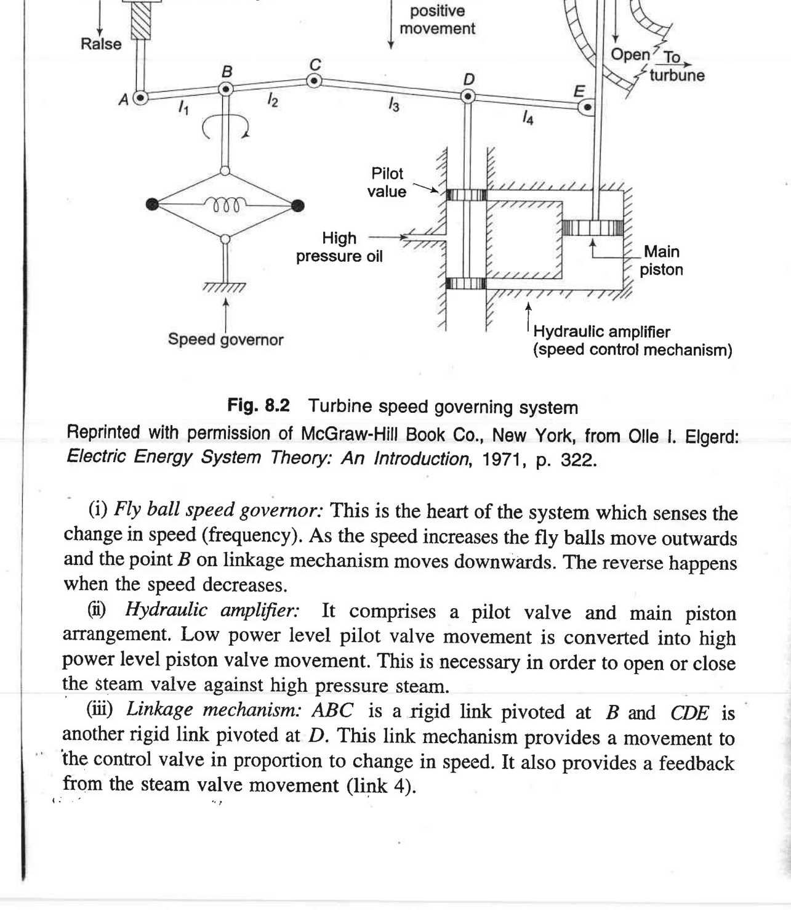

# Unit V — Power System Dynamics: Load-Frequency and Voltage Control

> *Why this unit exists:* A power system is not a static circuit — the load changes minute-to-minute, generators drift, and closed-loop control systems must constantly adjust turbine inputs and field excitation to keep frequency at 50/60 Hz and voltages near rated. This unit describes how turbines, governors, and excitation systems provide that control.
>
> Source: K&N Ch. 8 (book pp. 289–325; PDF pp. 154–171), plus supporting qualitative discussion of reactive power from K&N §6.9 (voltage control discussion, book pp. 230–235).

---

## 5.1 Two separate control problems — a fundamental split 🟡

The first thing to grasp is that **active power and frequency** are controlled by *different* mechanisms than **reactive power and voltage**.

- Active power (watts) is produced by the turbine driving the generator. If total generation of watts does not match total watts consumed (plus losses), the *rotational speed* of all generators changes — i.e., frequency changes. → Control loop: **turbine governor + AGC (Automatic Generation Control)**.
- Reactive power (VARs) is produced or absorbed by the generator's field excitation, shunt capacitors/inductors, SVCs, STATCOMs, and line charging. If reactive supply does not match reactive demand at a bus, that bus's *voltage* drops or rises. → Control loop: **exciter + AVR (Automatic Voltage Regulator)**, plus shunt/series compensation.

> 🟡 *Why are these decoupled?* In high-voltage transmission (where X >> R), the flow of real power P across a line depends primarily on the *angle difference* δ between the two ends, while reactive power Q depends primarily on the *voltage magnitude difference* |V<sub>s</sub>| − |V<sub>r</sub>|. Controlling P controls angles (hence frequency); controlling Q controls magnitudes (hence voltage). This decoupling is why we can design separate controllers. This is the single most important conceptual point in this unit.

> ⚠️ **Common misconception:** "If I increase mechanical power to a generator, its voltage goes up." No — increasing P<sub>m</sub> (more steam to turbine) initially makes the rotor accelerate, increasing δ and delivering more *real* power to the grid; voltage is controlled separately by the DC field current (excitation). If you want to change voltage, change excitation; if you want to change real-power output, change the turbine's steam/gate/water setting.

---

## 5.2 Turbines and speed governors — basic frequency control 🔴 Slow down

### The physical hardware
Every steam/hydro/gas turbine has a **speed governor** that senses shaft speed and adjusts the steam valve (or water gate, or fuel valve) to keep speed constant. The classic mechanical-hydraulic speed-governing system for a steam turbine (K&N Fig. 8.2) has four parts — a flyball speed sensor, a hydraulic amplifier (pilot valve + main piston), a linkage (ABC, CDE), and a speed-changer (the setpoint adjustment):



**Figure 5.1** — Turbine speed governing system: the flyball governor senses speed and moves point B; the linkage relays that motion to a pilot valve; high-pressure oil drives the main piston to open/close the steam valve; a feedback link from the valve to point D provides the proportional (droop) action; the speed changer at A lets the operator (or AGC) adjust the load setpoint. *(Reproduced from Olle I. Elgerd, Electric Energy Systems Theory: An Introduction, 1971, p. 322, as reprinted in K&N.)* *Source: K&N Fig. 8.2, book p. 291, PDF p. 154.*

How it works in plain words:
1. If the turbine speeds up (frequency rises), the flyballs fly outward and pull point B *down*.
2. That moves the pilot valve down, letting high-pressure oil push the main piston *up*, which **closes** the steam valve a bit.
3. Closing the valve reduces steam flow, which reduces mechanical power, slowing the turbine back down.
4. The linkage from the valve stem back to point D creates mechanical feedback: the valve doesn't keep closing forever — it stops when the linkage recenters the pilot valve. This built-in feedback is what produces **droop** (proportional, not integral, action).
5. The speed changer at A (a motor-driven screw controlled by the operator or AGC) moves the entire setpoint up or down, raising or lowering the power output at a given frequency.

### Generator-load model (𝚫 structure)
We linearize everything around a nominal operating point (small-signal model). Let Δ denote deviation from nominal. The power balance on the rotating mass (same M as in Unit III) is:
```
ΔP_m - ΔP_e = M dΔf/dt + D Δf                                       (5.1)
```
(K&N Eq. 8.11, book p. 299, with equivalent notation.) Here:
- M = inertia constant (same 2H/ω<sub>s</sub> as in Unit III),
- Δf = frequency deviation (pu),
- D = load-damping constant: the natural tendency of loads to draw less power when frequency drops (e.g., motor loads slow down, reducing P). D is typically 1–2% per 1% frequency change.
- ΔP<sub>m</sub> = change in mechanical power from governor action,
- ΔP<sub>e</sub> = change in electrical load (the disturbance).

### Droop control — how generators share load 🟡
A governor cannot hold frequency *exactly* constant in an interconnected system with multiple generators, because then the load split between generators would be indeterminate (multiple ways to match total P). Instead, governors are deliberately given **droop**: as a generator picks up more load, its speed setpoint *drops* slightly.

The steady-state governor characteristic is:
```
ΔP_m = - (1/R) Δf                                                   (5.2)
```
where R is the **droop** (speed regulation) in pu Hz / pu MW, or equivalently in percent. Typical R = 5% (0.05 pu): a 5% drop in frequency (from 50 Hz to 47.5 Hz) causes the unit to go from zero to full output. (K&N §8.2, book p. 297 onward.)

In words: if frequency falls (Δf < 0), ΔP<sub>m</sub> > 0 — the governor opens the valve and the unit picks up more power, opposing the frequency drop.

### Why droop, not perfect isochronous?
If two generators had zero droop (perfect "isochronous" control), they would "fight" — each would try to control frequency to its own setpoint, with unstable results. With 5% droop on both, load is shared automatically in proportion to each unit's rating: if a 100 MW and a 200 MW unit are on the same bus with R = 5% each, a ΔP load increase is split 1:2 between them (smaller unit picks up less, larger picks up more), because each requires the same Δf and R is on its own base. That is how grids operate.

> 🟡 *Everyday analogy:* Think of two springs supporting a board. If both springs have identical stiffness per unit weight, the load splits according to how much they deflect (droop). If one spring had infinite stiffness (zero droop) it would carry all load, and the other would carry nothing — brittle and bad for sharing. Droop = finite stiffness; essential for parallel operation.

### Steady-state frequency after a step load change
Substituting ΔP<sub>m</sub> = −(1/R)Δf into (5.1) at steady state (derivatives zero):
```
- Δf/R - ΔP_e = D Δf   ⇒   Δf = - ΔP_e / (D + 1/R)                   (5.3)
```
Frequency drops (Δf negative) proportionally to the size of the load step, divided by the total "frequency stiffness" (D + 1/R), with 1/R from the governor and D from load damping.

**❓ Understanding checkpoint:** Two parallel units have R = 0.05 (5%) and R = 0.04 (4%). For the same Δf, which picks up more power per unit MW rating?
  - *Answer:* The unit with smaller R (4%) has higher gain (1/R = 25 vs 20), so it picks up more. That's why units meant to carry more frequency-responsive load (spinning reserve) are set to lower droop.

### Worked example (two generators sharing a load step) 🟡

**Problem:** Two generators are operating in parallel at 50 Hz.
- Gen 1: rating 200 MW, R<sub>1</sub> = 5% = 0.05 pu on its own base
- Gen 2: rating 100 MW, R<sub>2</sub> = 4% = 0.04 pu on its own base
- Initially each is at half load: P<sub>1</sub> = 100 MW, P<sub>2</sub> = 50 MW, total generation 150 MW, frequency exactly 50 Hz.
- Load damping D = 0 (assume loads are not frequency-dependent — worst case for illustration, and standard for a first problem).

A 30 MW load is suddenly added. Find the new steady-state frequency and each generator's new output.

**Step-by-step reasoning:**

1. **Convert everything to a common base.** Choose S<sub>base</sub> = 100 MVA.
   - Gen 1 rating = 200 MVA = 2 pu. R<sub>1</sub> = 0.05 pu on 200 MVA base = 0.05 × (2/1) = 0.10 pu on 100 MVA base (recall: R in Hz/MW has units of frequency/power; converting pu R from one base to another: R<sub>new</sub> = R<sub>old</sub> × S<sub>old,base</sub>/S<sub>new,base</sub>).
   - Gen 2 rating = 100 MVA = 1 pu. R<sub>2</sub> = 0.04 pu on 100 MVA base = 0.04 pu (same base already).
   
   **Wait — easier approach for a first problem:** work in MW and Hz directly instead of pu. In physical units, the droop characteristic is:
   ```
   ΔP1 = −(P_rated1 / (R1 · f_nom)) · Δf
   ΔP2 = −(P_rated2 / (R2 · f_nom)) · Δf
   ```
   where P<sub>rated</sub> is the MW that corresponds to the full rated output (i.e., at Δf = −R·f<sub>nom</sub>, ΔP = P<sub>rated</sub>). Let's verify: for Gen 1, a 5% frequency drop is 2.5 Hz; at that Δf the unit picks up its full 200 MW rating, so the gain is 200 MW / 2.5 Hz = 80 MW/Hz. Similarly Gen 2: 100 MW / 2 Hz = 50 MW/Hz.

2. **Write the power balance at steady state (derivatives zero, D = 0):**
   ```
   ΔPm1 + ΔPm2 = ΔPe = 30 MW
   ΔPm1 = −(P_rated1/(R1·f_nom)) Δf = −(200/(0.05·50)) Δf = −80 Δf   (MW per Hz)
   ΔPm2 = −(100/(0.04·50)) Δf = −50 Δf
   ```
   The minus sign: if frequency drops (Δf < 0), ΔP<sub>m</sub> > 0 (units pick up load).

3. **Solve for Δf:**
   ```
   (−80 Δf) + (−50 Δf) = 30
   −130 Δf = 30
   Δf = −30/130 = −0.231 Hz
   ```
   New frequency f = 50 − 0.231 = **49.77 Hz**.

4. **Find the new outputs:**
   ```
   ΔP1 = −80·(−0.231) = 18.5 MW    → P1_new = 100 + 18.5 = 118.5 MW
   ΔP2 = −50·(−0.231) = 11.5 MW    → P2_new = 50 + 11.5 = 61.5 MW
   ```
   Check: 18.5 + 11.5 = 30 MW (matches the load step ✓).

5. **Does this make sense?** Gen 1 is twice the size of Gen 2 and has a slightly *higher* (less-stiff) droop in Hz/MW terms (2.5 Hz / 200 MW = 0.0125 Hz/MW vs 2 Hz / 100 MW = 0.02 Hz/MW). Stiffer droop (smaller Hz/MW) picks up more MW per Hz of deviation. In fact the load is split 62%/38%, which is in the ratio 80:50 = 1.6:1. This is the **natural, automatic load sharing** droop provides, without any communication between plants.

6. **What AGC does next.** The 0.23 Hz steady-state error is the primary (droop) response. Over the next 30 seconds or so, AGC at each generator integrates the ACE signal and slowly raises both generators' speed-changer setpoints by the right amount to restore frequency to 50 Hz while respecting the desired economic dispatch (which, in this case, would likely push more of the 30 MW onto whichever unit is cheaper — that's the Unit IV equal-λ problem deciding the final sharing; AGC's job is simply to eliminate Δf).

**🟡 Takeaway:** Droop is what lets a thousand generators on a grid share a sudden load change *instantly* and *stably* without talking to each other. The cost is a small steady-state frequency error; AGC cleans that up over seconds to minutes.

---

## 5.3 Automatic Generation Control (AGC) 🔵 (secondary control)

Droop control (primary control) stabilizes frequency after a disturbance but leaves a *steady-state error* — Δf is nonzero, as Eq. (5.3) shows. To restore frequency to its setpoint (50 or 60 Hz) and to restore scheduled inter-area (tie-line) power flows, a slow outer loop — **AGC** or **secondary control** — slowly adjusts the governor setpoints (raises or lowers the "load reference" on each unit).

AGC implements integral action on the **Area Control Error (ACE)**:
```
ACE = ΔP_tie - B Δf                                                  (5.4)
```
where ΔP<sub>tie</sub> is deviation of tie-line flow from schedule and B is frequency-bias setting (MW/Hz). The AGC integrates ACE and adjusts generation setpoints until ACE = 0, which drives both frequency and tie-line error to zero. (K&N §8.3–§8.4, book pp. 305–310.)

> 🟡 *Time scale:* Primary (droop) response acts in 2–10 seconds; secondary (AGC) acts in 30 seconds to a few minutes; tertiary (economic dispatch from Unit IV) re-optimizes every few minutes to an hour. These are separate time scales, which is why they are designed separately.

---

## 5.4 Reactive power, excitation, and voltage control 🟡

### Where VARs come from — and go
Reactive power is produced or absorbed by nearly every component in the system:
- **Generators** can produce or absorb VARs by adjusting field current. Overexcited ⇒ generator supplies VARs (Q > 0); underexcited ⇒ generator absorbs VARs (Q < 0).
- **Shunt capacitors** supply VARs (fixed or switched); shunt inductors absorb VARs.
- **Transmission lines:** when heavily loaded, series reactance absorbs VARs; when lightly loaded, shunt capacitance supplies VARs (the Ferranti effect causes open-circuit voltage rise).
- **Transformers** absorb VARs due to their series leakage reactance and magnetizing current.
- **Loads** (induction motors especially) absorb VARs.

The balance of VARs near a bus determines that bus's voltage. Unlike watts, VARs cannot be shipped long distances efficiently (VAR flow causes large I²X drops and voltage collapse), so VARs must be managed **locally**. That is why voltage control is a local problem (excitation, capacitor banks, SVCs at substations) while frequency control is system-wide (watts travel freely across the grid, frequency is the same everywhere in steady state).

### Excitation system and AVR 🟡
Each synchronous generator has an **exciter** — a separate DC or AC source supplying DC current to the rotor field winding. Increasing field current increases the internal voltage E, which increases terminal voltage and boosts reactive output. The **Automatic Voltage Regulator (AVR)** senses terminal voltage, compares it to a setpoint, and adjusts the exciter output to close the gap.

The basic AVR loop (K&N §8.6, book pp. 318–320) is a feedback controller with:
- A voltage transducer measuring |V<sub>t</sub>|,
- An error amplifier (setpoint − measurement),
- The exciter (a gain plus time constant),
- The generator field (which turns field voltage into E, which then determines |V<sub>t</sub>| through the synchronous reactance).

Like any feedback loop, the AVR must be tuned to be stable (adequate phase margin). Excitation systems also have limits on maximum field current (overexcitation limit, to protect rotor from overheating) and minimum field current (underexcitation limit, to prevent loss of synchronism).

> 🟡 *Coordination:* AVRs act fast (fractions of a second to seconds) to hold voltage; slower, plant-level or system-level reactive-power optimization adjusts setpoints over minutes.

---

## 5.5 Putting Unit V together 🟡

You can remember the whole unit as two separate control stacks, operating at three time scales each:

**Frequency / Active Power (P-f control):**
1. Inertia (instantaneous): rotors store/release kinetic energy — the "M" term.
2. Primary / droop control (seconds): governors open valves/ gates, restoring power balance at a slightly off-nominal frequency.
3. Secondary / AGC (30 sec to minutes): integral control restores frequency to 50/60 Hz and tie flows to schedule.
4. Tertiary / Economic dispatch (minutes to hour): re-optimizes unit outputs for cost (Unit IV).

**Voltage / Reactive Power (Q-V control):**
1. Inherent voltage sensitivity of loads (instantaneous): D-like effect.
2. Excitation/AVR (fractions of seconds to seconds): adjusts generator field current to hold terminal voltage.
3. Shunt/series compensation switching, SVC/STATCOM action (cycles to seconds): fast power-electronic voltage support.
4. Operator / SCADA dispatch of capacitors and transformer taps (minutes to hours): adjusts to schedule voltages and manage losses.

---

## 5.6 Unit V self-check

1. If frequency drops, what does that tell you about P<sub>m</sub> versus P<sub>e</sub>? What happens to the rotors?
   - *It means P<sub>e</sub> > P<sub>m</sub> (more electrical load than mechanical input). Each rotor decelerates (loses kinetic energy) because there is a net retarding torque — that is what the swing equation says, and that is why governors detect speed and open valves.*
2. What is the purpose of droop?
   - *To allow multiple generators to share load stably without fighting; with zero droop load division is indeterminate.*
3. Why can't AGC rely on governors alone?
   - *Because droop leaves a steady-state frequency error (Eq. 5.3); AGC adds integral action to drive that error to zero.*
4. If you need to raise voltage at a bus that's sagging under heavy inductive load, do you add a shunt capacitor or a shunt inductor?
   - *A shunt capacitor — it supplies the VARs the load is consuming locally, reducing the VAR flow through the line reactance and reducing the voltage drop. A shunt inductor would absorb VARs and make voltage lower still (used for overvoltage on lightly loaded lines).*
5. Why is voltage control "local" whereas frequency control is "system-wide"?
   - *Because frequency is an integral of power imbalance across the entire synchronous system (one frequency everywhere) and watts travel easily across the grid; by contrast, VARs cause large voltage drops through line reactance, so VARs must be supplied close to where they're needed — each bus is largely responsible for its own voltage magnitude.*

---

## 5.7 Practice problems (answers only — solve on your own)

**P1.** (Droop, single unit) A 500 MW generator has R = 5% droop. By how much does frequency drop (from 50 Hz) when the unit picks up 100 MW from a no-load initial state? Assume D = 0.
  - *Final answer:* Full 500 MW corresponds to 5% of 50 Hz = 2.5 Hz change. Picking up 100 MW (1/5 of rating) gives Δf = −2.5/5 = −0.5 Hz, so f = 49.5 Hz.

**P2.** (Two-unit load sharing) Three parallel generators: G1 rated 200 MW, R₁ = 4%; G2 rated 300 MW, R₂ = 5%; G3 rated 500 MW, R₃ = 3%. A 60 MW load increase drops frequency. D = 0. Find the new load on each unit (MW increase) and the frequency deviation in Hz, starting from 50 Hz with units at half load initially.
  - *Final answers:* Gains in MW/Hz: β₁ = 200/(0.04·50) = 100 MW/Hz; β₂ = 300/(0.05·50) = 120 MW/Hz; β₃ = 500/(0.03·50) ≈ 333.3 MW/Hz. Total β = 553.3 MW/Hz. Δf = −60/553.3 ≈ −0.108 Hz (f ≈ 49.89 Hz). ΔP₁ ≈ 10.8 MW, ΔP₂ ≈ 13.0 MW, ΔP₃ ≈ 36.2 MW (check sum ≈ 60 MW). Notice the largest-stiffness unit (G3, lowest % droop × largest rating) picks up most of the load.

**P3.** (D + 1/R stiffness) An island system has total generation capacity 2000 MW with an average composite droop R = 0.05 pu on 2000 MVA base, and load damping D = 1.5 pu on 2000 MVA base (meaning load drops 1.5% per 1% frequency drop). Find the frequency change after a 50 MW generation loss (ΔP = −0.025 pu).
  - *Final answer:* β = D + 1/R = 1.5 + 20 = 21.5 pu/pu (on 2000 MVA, 50 Hz). Δf in pu = −ΔP/β = 0.025/21.5 ≈ 0.00116 pu = 0.058 Hz. So f ≈ 49.94 Hz — notice how load damping *plus* governor droop stiffen the system dramatically compared to D = 0.

**P4.** (Conceptual) If AGC is disabled on all units in an isolated system, what happens to frequency after a permanent 100 MW load increase?
  - *Final answer:* Primary droop response catches the frequency at a new steady state below 50 Hz (proportional to the size of the step and the total β = D+1/R), but there is a persistent steady-state error — frequency never returns to 50 Hz. AGC (secondary control) is what integrates that error out over tens of seconds by slowly raising speed-changer setpoints.

---

## 5.8 Where these notes leave off 🟡

If you have read these five units in order and worked the self-checks, you now have the conceptual skeleton of an introductory power-systems analysis course:

- You can decompose any unbalanced three-phase situation into its three symmetrical components and see why that makes the problem tractable (Unit I).
- You can compute fault currents for the four main shunt fault types and know how to size a circuit breaker (Unit II).
- You understand the physics of synchronism, can read a P-δ curve, and can apply the equal-area criterion to judge transient stability (Unit III).
- You know why economic dispatch is a marginal-cost problem, how losses introduce penalty factors via B-coefficients, and what the coordination equation says (Unit IV).
- You can explain how governors, droop, AGC, and AVRs divide the work of holding frequency and voltage on target across timescales from milliseconds to hours (Unit V).

From here the natural next topics (taught in advanced power-systems courses) are: load-flow computation in detail (Newton-Raphson, fast-decoupled), state estimation, protection relaying in depth, power-system dynamics with multi-machine models, HVDC and FACTS devices, renewable integration, and power-system restructuring/markets. Each of these builds on the skeleton these notes have put in place.
